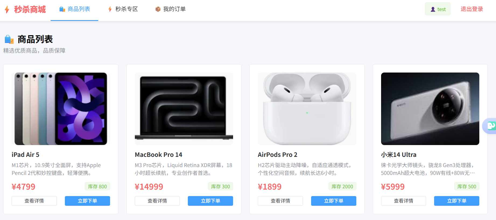
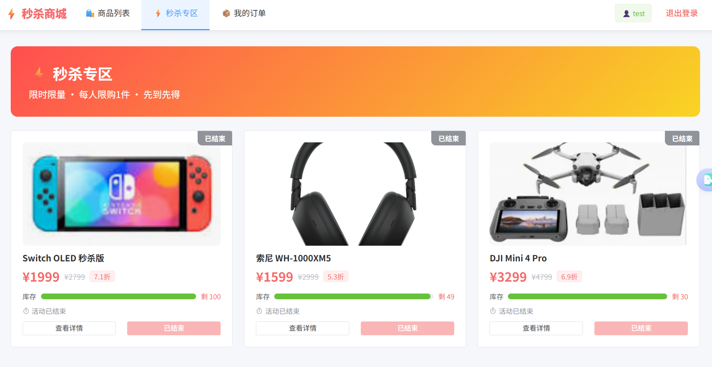
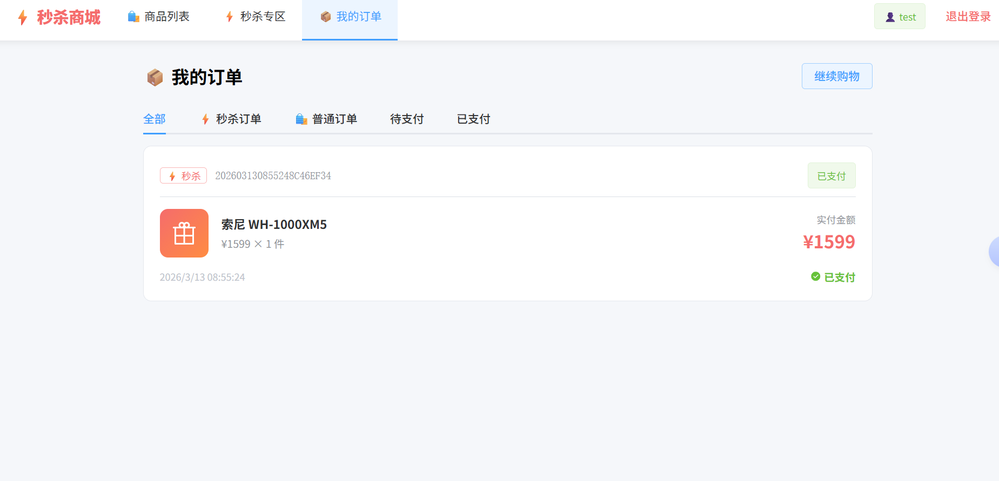

# 商品库存与秒杀系统

基于 Spring Boot + Redis + Kafka 构建的高并发商品与秒杀平台，采用**微服务架构**拆分为 stock-service（库存域）与 order-service（订单域），支持双后端实例负载均衡、TCC 分布式事务、防超卖四层防线、消息队列异步削峰等核心特性。

详细说明请看"作业说明"文件夹。

---

## 目录

1. [技术栈](#技术栈)
2. [快速启动](#快速启动)
3. [系统架构](#系统架构)
4. [数据库设计](#数据库设计)
5. [核心设计](#核心设计)
6. [API 接口](#api-接口)
7. [压测指南](#压测指南)
8. [前端页面](#前端页面)

---

## 技术栈

| 层次 | 技术 |
|------|------|
| 后端框架 | Spring Boot 3.2 + MyBatis + Maven（Java 17） |
| 数据库 | MySQL 8.0（两组独立主从集群，读写分离） |
| 缓存 | Redis 7（分布式缓存 + 原子预减库存） |
| 消息队列 | Kafka 3.x（KRaft 模式，无 ZooKeeper） |
| 前端 | Vue 3 + Element Plus + Vite |
| 代理 | Nginx（反向代理 + 负载均衡 + 动静分离） |
| 容器 | Docker + Docker Compose |
| 认证 | JWT |
| 分布式事务 | 自研 TCC（Try-Confirm-Cancel），乐观锁 + 幂等保障 |

---

## 快速启动

**环境要求：** Docker、Docker Compose、Node.js 18+

```bash
# 1. 安装前端依赖并构建静态资源
cd frontend
npm install
npm run build
cd ..

# 2. 启动所有容器（首次启动或修改了 Docker 相关配置时使用）
docker-compose up -d --build

# 3. 查看后端日志
docker-compose logs -f stock-service-1 stock-service-2 order-service-1 order-service-2
```

访问地址：http://localhost

**注意：** 如果修改了 `nginx/static/` 下的静态文件或新增了 Docker volume，需要先销毁旧容器再重建：

```bash
docker-compose down -v
cd frontend && npm run build && cd ..
docker-compose up -d --build
```

### 切换 Nginx 负载均衡算法

编辑 `nginx/conf.d/default.conf` 中的 `upstream` 块（默认轮询，可改为 `least_conn`、`ip_hash` 等），然后热重载：

```bash
docker-compose exec nginx nginx -s reload
```

---

## 系统架构


**五层架构：** 客户端 → Nginx 接入层 → 微服务集群（stock-service + order-service）→ 中间件层（Redis + Kafka）→ 数据层（两组 MySQL 主从）。

### 微服务拆分

| 服务 | 端口 | 实例 | 职责 | 数据库 |
|------|------|------|------|--------|
| **stock-service** | 8081 / 8083 | 2 个 | 商品管理、库存扣减、秒杀入口、Kafka 生产者 + 消费者、TCC Stock 参与者 | stock_db（Master :3308 / Slave :3309） |
| **order-service** | 8082 / 8084 | 2 个 | 用户认证（JWT）、订单生命周期、TCC 协调器、超时取消任务 | order_db（Master :3310 / Slave :3311） |

**Nginx 路由规则：**
- `/api/(seckill\|product\|stock)/` → `stock_cluster`（轮询到 stock-service 实例）
- `/api/(order\|user)/` → `order_cluster`（轮询到 order-service 实例）

**服务间通信：** 通过 HTTP REST API 进行跨服务调用，TCC 事务的 Try/Confirm/Cancel 阶段均通过内部 HTTP 接口协调。

**普通商品下单**：同步链路，Redis 缓存加速读，MySQL 持久化写。

**秒杀商品下单**：异步链路，Redis 原子预减拦截高并发，通过 Kafka 异步写入 MySQL，采用 TCC（Try-Confirm-Cancel）补偿型事务保障库存与订单的强一致性，前端轮询获取结果。

---

## 数据库设计


系统采用**两组独立数据库集群**，服务间不共享数据库，跨库数据通过 HTTP REST API 访问。

### stock_db（库存库）

```
product（普通商品表）
  id | name | description | price | stock | image_url | status
  created_at | updated_at

seckill_product（秒杀商品表）
  id | name | description | origin_price | seckill_price
   | total_stock | avail_stock | locked_stock | version
   | image_url | start_time | end_time | status
   | created_at | updated_at
  -- avail_stock: 可用库存，TCC Try 时扣减
  -- locked_stock: TCC 锁定库存，Confirm 时永久扣减，Cancel 时释放回 avail_stock
  -- version: 乐观锁版本号，防止并发更新冲突
  -- start_time/end_time: 控制秒杀时间窗口
```

### order_db（订单库）

```
user（用户表）
  id | username | password(BCrypt) | email | phone | status
  created_at | updated_at
  -- uk_username: 用户名唯一索引

order（统一订单表）
  id | order_no | user_id | product_id（逻辑外键，指向 stock_db）
   | product_type（0普通/1秒杀）| product_name
   | quantity | unit_price | amount
   | status | timeout_at
   | created_at | updated_at
  -- status: -1=TCC预留中 0=待支付 1=已支付 2=已取消
  -- timeout_at: TCC超时时间，超过此时间未confirm则自动cancel
  -- idx_status_timeout: (status, timeout_at) 复合索引，用于超时扫描
```

### 数据库账号

| 库 | 读写账号 | 只读账号 | 复制账号 |
|----|----------|----------|----------|
| stock_db | stock / stock123 | stock_ro / stock_ro123 | stock_repl / StockRepl@123 |
| order_db | order_user / order123 | order_ro / order_ro123 | order_repl / OrderRepl@123 |

普通商品与秒杀商品使用**独立表**，原因如下：秒杀商品需要专有字段（时间窗口、乐观锁版本号、锁定库存），若合并到同一张表会引入大量空值，且秒杀写入频率远高于普通商品，分表可避免热点锁竞争。

---

## 核心设计

### 1. 防超卖四层防线 + TCC 分布式事务

秒杀场景下，防超卖按层级依次拦截：

```
第 1 层：Redis DECR 原子预减
    └── 内存级操作，响应 < 1ms，拦截 99% 的无效并发请求
        库存不足时直接返回，不进入后续流程

第 2 层：Redis SETNX 防重复下单
    └── key = "seckill:uid:{userId}:sp:{spId}"
        每人每件秒杀商品限购 1 次，重复请求直接拒绝

第 3 层：MySQL TCC Try 乐观锁预留库存
    └── avail_stock -= qty, locked_stock += qty（乐观锁 version）
        将库存从"可用"转移到"锁定"，为后续 Confirm/Cancel 预留状态

第 4 层：MySQL TCC Confirm 乐观锁永久扣减
    └── locked_stock -= qty（乐观锁 version）
        支付时永久消费锁定库存，保证库存不超卖
```

秒杀订单采用 **TCC（Try-Confirm-Cancel）补偿型事务**，跨服务通过 HTTP REST 协调：

- **Try 阶段**（stock-service Kafka 消费者）：预留库存（avail→locked）+ 远程调用 order-service 创建 TRYING 状态订单
- **Confirm 阶段**（order-service 支付接口）：本地订单确认 + 远程调用 stock-service 永久扣减库存
- **Cancel 阶段**（order-service 取消/超时任务）：本地订单取消 + 远程调用 stock-service 释放库存 + Redis 回滚

消费者写入失败时，回滚第 1 层的 Redis 预扣（`INCRBY`），避免库存永久丢失。

**所有 TCC 操作均使用乐观锁**（`version` 字段）和**状态条件更新**保证幂等性，防止重复执行。

### 2. Kafka 异步削峰

秒杀瞬时并发极高，若同步执行"预减 → 写 MySQL → 返回"，数据库连接池会迅速耗尽。Kafka 将 DB 写操作异步化：

```
用户请求
   │
   ├─① Redis DECR 预减库存（同步，< 1ms）
   ├─② Redis SETNX 幂等校验（同步，< 1ms）
   ├─③ 发送消息到 Kafka（同步，< 5ms）
   └─④ 立即返回 {status: "PROCESSING"}（用户不等待 DB）

Kafka Consumer（异步，stock-service 内）
   ├─ TCC Try：本地预留库存 + HTTP 创建 TRYING 订单
   ├─ 成功 → 手动 ACK
   └─ 失败 → 不 ACK，触发重试；回滚 Redis 预扣库存
```

前端采用轮询模式：每秒请求 `GET /api/seckill/order/{spId}`，最多等待 30 秒。

**Kafka Topic 配置：**

| 配置项 | 值 | 原因 |
|--------|-----|------|
| Topic | `seckill-order` | 秒杀订单专用通道 |
| 分区数 | 3 | 支持 3 个消费者并行处理 |
| 副本数 | 1 | 开发环境单节点，生产建议改为 3 |
| 消息 Key | `userId:spId` | 同一用户同一商品的消息路由到同一分区，保证顺序 |
| `acks` | `all` | 所有副本确认后才返回，防消息丢失 |
| `enable.idempotence` | `true` | 幂等生产者，网络重传不产生重复消息 |
| offset 提交 | 手动（`manual_immediate`） | 处理成功后才移动消费位点，失败自动重试 |

### 3. 分布式缓存（防三大问题）

| 问题 | 场景 | 解决方案 |
|------|------|---------|
| 缓存穿透 | 查询不存在的商品，每次都打到 DB | 缓存空值 `"NULL"`，TTL = 5 分钟 |
| 缓存击穿 | 热点 key 过期，瞬间大量请求同时重建缓存 | Redis 分布式锁，只放一个线程重建，其余等待 |
| 缓存雪崩 | 大量 key 同时过期，DB 压力骤增 | 过期时间加随机抖动 ±5 分钟，错开过期时间 |

### 4. 读写分离（AOP 动态数据源）

每个微服务连接自己的 MySQL 主从集群，通过 AOP 实现读写分离：

```
请求进入 Service 方法
   │
   ├─ DataSourceAspect 拦截
   │   ├─ 方法名以 get/find/list/query/count/select 开头 → 路由到 Slave（只读）
   │   ├─ 标注 @DS(SLAVE) 注解 → 路由到 Slave
   │   └─ 其余方法 → 路由到 Master（读写）
   │
   └─ DynamicDataSource（继承 AbstractRoutingDataSource）
       └─ 通过 ThreadLocal 持有当前数据源标识
```

### 5. Nginx 动静分离

```nginx
# 静态资源（文件名含 hash，内容变更时 URL 自动变化）
location ~* \.(js|css)$ {
    expires 30d;
    add_header Cache-Control "public, max-age=2592000, immutable";
}

location ^~ /static/images/ {
    expires 90d;
    add_header Cache-Control "public, max-age=7776000, immutable";
}

# 动态 API → 按路径分发到对应微服务集群
location ~ ^/api/(seckill|product|stock)/ { proxy_pass http://stock_cluster; }
location ~ ^/api/(order|user)/            { proxy_pass http://order_cluster; }
```

因为静态资源文件名含内容 hash，浏览器可以放心强缓存——文件内容变了，文件名也会变，不存在拿到旧版本的问题。

---

## API 接口

### 用户

| 方法 | 路径 | 说明 |
|------|------|------|
| POST | `/api/user/register` | 注册 |
| POST | `/api/user/login` | 登录，返回 JWT |

### 普通商品

| 方法 | 路径 | 说明 |
|------|------|------|
| GET | `/api/product/list` | 商品列表（Redis 缓存） |
| GET | `/api/product/{id}` | 商品详情（防穿透/击穿/雪崩） |

### 秒杀商品

| 方法 | 路径 | 说明 |
|------|------|------|
| GET | `/api/seckill/list` | 秒杀商品列表 |
| GET | `/api/seckill/{id}` | 秒杀商品详情（含倒计时、库存进度） |
| POST | `/api/seckill/do` | 执行秒杀，异步，立即返回排队状态 |
| GET | `/api/seckill/order/{spId}` | 查询秒杀结果（前端轮询） |
| POST | `/api/seckill/warmup/{id}` | 手动预热库存到 Redis |

### 订单

| 方法 | 路径 | 说明 |
|------|------|------|
| POST | `/api/order/place` | 普通商品下单 |
| GET | `/api/order/my` | 我的订单（需登录） |
| GET | `/api/order/{orderNo}` | 订单详情 |
| POST | `/api/order/pay/{no}` | 模拟支付（触发 TCC Confirm） |
| POST | `/api/order/cancel/{no}` | 取消订单（普通商品回滚库存，秒杀订单触发 TCC Cancel） |

---

## 压测指南

使用 JMeter 验证各模块性能。

### 验证动静分离

- **URL：** `http://localhost/static/images/product_1.svg`（或从浏览器 F12 获取实际静态资源路径）
- **预期：** 响应时间 < 5ms，响应头含 `Cache-Control: public, max-age=...`，`X-Static-Type: product-image`

### 验证负载均衡

- **URL：** `GET http://localhost/api/product/list`
- **预期：** 多次请求分发到不同 stock-service 实例（通过日志 `upstream_addr` 验证）

### 验证秒杀防超卖

- **URL：** `POST http://localhost/api/seckill/do`
- **请求体：** `{"seckillProductId": 1, "quantity": 1}`
- **Header：** `Authorization: Bearer <token>`（先调用登录接口获取）
- **并发配置：** 建议 500~1000 线程，循环 1 次，模拟瞬时抢购

压测结束后，查询数据库验证库存不为负数：

```sql
SELECT avail_stock, locked_stock, total_stock
FROM seckill_product
WHERE id = 1;
-- avail_stock 应 >= 0，avail_stock + locked_stock 应 = total_stock
```

## 前端页面

### 登录页面

](说明图片/登录界面.png)


### 商品列表


### 秒杀专区


### 我的订单

