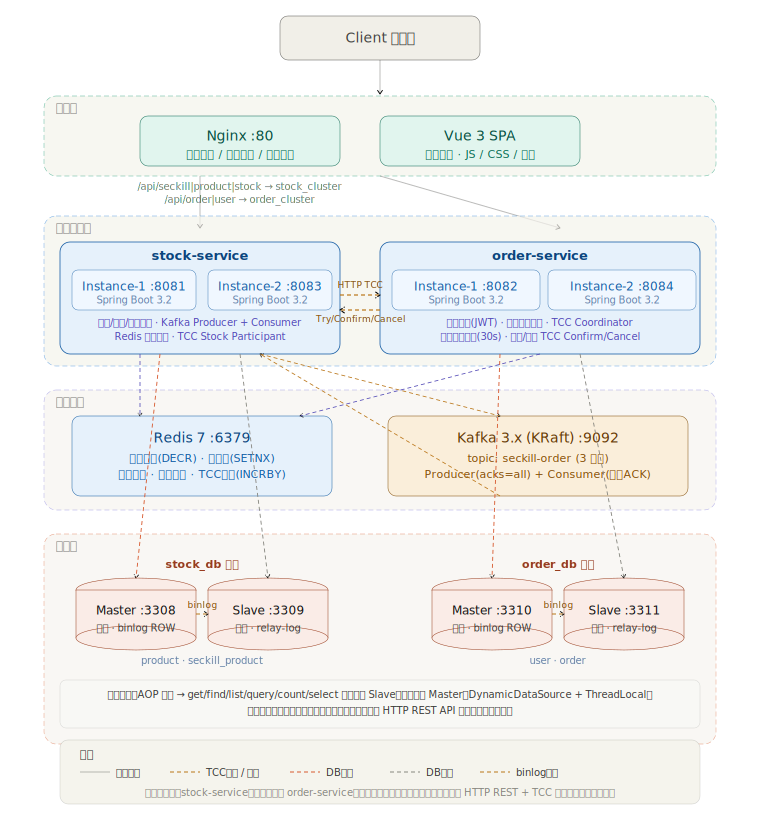
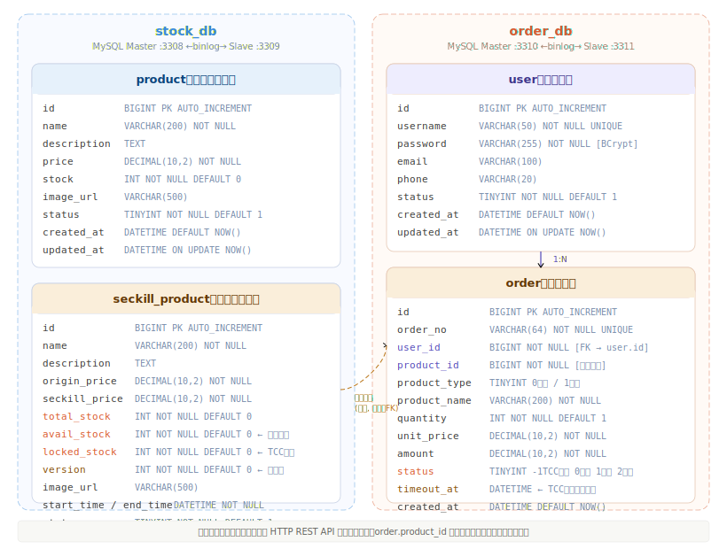

# 第一讲：系统设计与基础框架

## 一、作业要求

- 绘制系统架构草图（服务拆分：用户服务、商品服务、订单服务、库存服务）
- 定义各服务API接口（RESTful）
- 数据库ER图（用户表、商品表、库存表、订单表）
- 技术栈选型说明（编程语言、框架、中间件初选）
- 初始化项目代码仓库（Git）
- 搭建基础开发环境（Spring Boot + MyBatis + MySQL）
- 搭建项目代码框架，实现简单的用户注册登录功能

## 二、系统架构设计

### 2.1 整体架构

本系统采用**微服务架构**，按业务域拆分为两个独立微服务，各自拥有独立数据库，服务间通过 HTTP REST API 通信，通过 TCC（Try-Confirm-Cancel）模式保证分布式事务一致性。


### 2.2 服务拆分

| 微服务 | 职责 | 对应数据库 | 端口 |
|--------|------|-----------|------|
| **stock-service** | 商品管理、库存扣减、秒杀入口(Redis DECR→Kafka)、TCC库存预留 | `stock_db` | 8081/8083 |
| **order-service** | 用户注册登录、订单生命周期管理、TCC订单创建/确认/取消 | `order_db` | 8082/8084 |

每个微服务独立部署两个实例，通过 Nginx 负载均衡。服务间通过 `RestTemplate` HTTP 调用进行跨服务操作，使用 Saga 补偿模式保证分布式事务一致性。

#### stock-service 内部模块

| 模块 | 职责 | 对应代码位置 |
|------|------|-------------|
| 商品服务 | 商品列表、详情查询 | `ProductController` / `ProductServiceImpl` |
| 库存服务 | 普通商品库存扣减/回滚、TCC库存预留/确认/取消 | `StockController` / `TccStockParticipant` |
| 秒杀服务 | 秒杀商品管理、Redis预扣库存、Kafka异步下单 | `SeckillController` / `StockSeckillServiceImpl` |
| Kafka消费者 | 消费秒杀消息、调Order Service创建订单 | `KafkaStockConsumerService` |

#### order-service 内部模块

| 模块 | 职责 | 对应代码位置 |
|------|------|-------------|
| 用户服务 | 注册、登录、JWT认证 | `UserController` / `UserServiceImpl` |
| 订单服务 | 普通下单(调Stock Service扣库存)、支付、取消、查询 | `OrderController` / `OrderServiceImpl` |
| 内部接口 | 暴露给Stock Service的TCC订单操作 | `InternalOrderController` / `TccOrderParticipant` |
| 超时任务 | 每30秒扫描超时秒杀订单，自动执行TCC Cancel | `SeckillOrderTimeoutTask` |

## 三、RESTful API 接口定义

### 3.1 用户服务 (`/api/user`) — order-service

| 方法 | 路径 | 说明 |
|------|------|------|
| POST | `/api/user/register` | 用户注册 |
| POST | `/api/user/login` | 用户登录，返回JWT Token |

### 3.2 商品服务 (`/api/product`) — stock-service

| 方法 | 路径 | 说明 |
|------|------|------|
| GET | `/api/product/list` | 获取在售商品列表 |
| GET | `/api/product/{id}` | 获取商品详情 |

### 3.3 订单服务 (`/api/order`) — order-service

| 方法 | 路径 | 说明 |
|------|------|------|
| POST | `/api/order/place` | 普通商品下单（HTTP调Stock Service扣库存→本地创建订单） |
| GET | `/api/order/my` | 查询我的订单 |
| GET | `/api/order/{orderNo}` | 按订单号查询 |
| POST | `/api/order/pay/{no}` | 订单支付（本地TCC Confirm + HTTP调Stock Service确认库存） |
| POST | `/api/order/cancel/{no}` | 取消订单（本地TCC Cancel + HTTP调Stock Service释放库存） |

### 3.4 秒杀服务 (`/api/seckill`) — stock-service

| 方法 | 路径 | 说明 |
|------|------|------|
| GET | `/api/seckill/list` | 获取秒杀商品列表 |
| GET | `/api/seckill/{id}` | 获取秒杀商品详情 |
| POST | `/api/seckill/do` | 提交秒杀请求（Redis DECR → Kafka） |
| GET | `/api/seckill/order/{spId}` | 查询秒杀订单结果（HTTP代理到Order Service） |
| POST | `/api/seckill/warmup/{id}` | 手动预热库存 |

### 3.5 库存内部接口 (`/api/stock`) — stock-service（供Order Service调用）

| 方法 | 路径 | 说明 |
|------|------|------|
| POST | `/api/stock/decrease` | 普通商品扣减库存 |
| POST | `/api/stock/increase` | 回滚增加库存 |
| POST | `/api/stock/reserve` | TCC Try：预留秒杀库存 |
| POST | `/api/stock/confirm` | TCC Confirm：永久扣减预留库存 |
| POST | `/api/stock/cancel` | TCC Cancel：释放预留库存 |

### 3.6 订单内部接口 (`/api/order/internal`) — order-service（供Stock Service调用）

| 方法 | 路径 | 说明 |
|------|------|------|
| POST | `/api/order/internal/create` | TCC Try：创建TRYING状态订单 |
| POST | `/api/order/internal/confirm` | TCC Confirm：TRYING → PENDING |
| POST | `/api/order/internal/cancel` | TCC Cancel：TRYING → CANCELLED |
| GET | `/api/order/internal/count` | 幂等检查（用户+商品是否已存在有效订单） |
| GET | `/api/order/internal/user-product` | 按用户+商品查询秒杀订单 |

## 四、数据库ER图

### 4.1 核心表结构



### 4.2 表关系说明

系统采用两组独立数据库集群，服务间不共享数据库：

- **stock_db**（库存服务）: `product`（普通商品表）、`seckill_product`（秒杀商品表）
- **order_db**（订单服务）: `user`（用户表）、`order`（订单表）
- **user → order**: 一对多（一个用户可以有多个订单）— 同库，物理外键
- **product_id → order.product_id**: 逻辑关联（跨库，不建物理外键约束，通过 HTTP 访问）
- **order.product_type**: 区分普通商品(0)和秒杀商品(1)
- **order.status**: `-1`TCC预留中 / `0`待支付 / `1`已支付 / `2`已取消
- **order.timeout_at**: TCC 超时时间，用于自动取消未支付的秒杀订单

## 五、技术栈选型

| 层次 | 技术 | 版本 | 选型理由 |
|------|------|------|---------|
| **后端框架** | Spring Boot | 3.2.0 | 主流Java Web框架，自动配置、生态丰富 |
| **ORM** | MyBatis | 3.0.3 | 灵活的SQL映射，适合复杂查询场景 |
| **数据库** | MySQL | 8.0 | 成熟稳定，支持主从复制、事务 |
| **缓存** | Redis | 7.x | 高性能内存缓存，支持原子操作 |
| **消息队列** | Apache Kafka | 7.5.0 | 高吞吐量，适合秒杀削峰填谷 |
| **前端框架** | Vue 3 + Element Plus | - | 响应式UI，组件库丰富 |
| **构建工具** | Vite | - | 快速的前端构建工具 |
| **容器化** | Docker + Docker Compose | - | 环境一致性，便于部署 |
| **反向代理** | Nginx | 1.25 | 负载均衡、动静分离 |
| **认证** | JWT (jjwt) | 0.11.5 | 无状态认证，适合分布式场景 |
| **密码加密** | Spring Security Crypto | - | BCryptPasswordEncoder，安全性高 |
| **分布式事务** | TCC（自研） + Saga补偿 | - | Try-Confirm-Cancel 库存预留，跨服务失败时Saga补偿回滚 |
| **定时任务** | Spring Scheduling | - | 每30秒扫描超时秒杀订单，自动执行 TCC Cancel |

## 六、项目代码框架

### 6.1 目录结构

```
seckill-rw/
├── stock-service/                    # 库存微服务 (port 8081)
│   ├── src/main/java/com/seckill/stock/
│   │   ├── config/                   # 配置类（数据源、Redis、Kafka、跨域、RestTemplate）
│   │   ├── controller/               # 控制器（ProductController、SeckillController、StockController）
│   │   ├── datasource/               # 读写分离数据源路由
│   │   ├── mapper/                   # MyBatis Mapper（ProductMapper、SeckillProductMapper）
│   │   ├── model/                    # 数据模型（entity/dto/vo）
│   │   ├── service/                  # 服务层
│   │   │   ├── impl/                 # 服务实现（含KafkaStockConsumerService）
│   │   ├── tcc/                      # TCC库存参与者（TccStockParticipant）
│   │   └── utils/                    # 工具类（Redis、雪花算法、JWT）
│   ├── src/main/resources/
│   │   ├── application.yml           # 应用配置（stock_db数据源）
│   │   └── mapper/                   # MyBatis XML映射文件
│   ├── pom.xml
│   └── Dockerfile
├── order-service/                    # 订单微服务 (port 8082)
│   ├── src/main/java/com/seckill/order/
│   │   ├── config/                   # 配置类（数据源、Redis、跨域、RestTemplate）
│   │   ├── controller/               # 控制器（OrderController、UserController、InternalOrderController）
│   │   ├── datasource/               # 读写分离数据源路由
│   │   ├── mapper/                   # MyBatis Mapper（OrderMapper、UserMapper）
│   │   ├── model/                    # 数据模型（entity/dto/vo）
│   │   ├── service/                  # 服务层
│   │   │   └── impl/                 # 服务实现（OrderServiceImpl、UserServiceImpl）
│   │   ├── tcc/                      # TCC订单参与者（TccOrderParticipant）
│   │   ├── task/                     # 定时任务（SeckillOrderTimeoutTask）
│   │   └── utils/                    # 工具类（JWT、Redis、雪花算法）
│   ├── src/main/resources/
│   │   ├── application.yml           # 应用配置（order_db数据源）
│   │   └── mapper/                   # MyBatis XML映射文件
│   ├── pom.xml
│   └── Dockerfile
├── frontend/                         # 前端Vue3项目
│   └── src/
│       ├── api/                      # API请求封装
│       ├── router/                   # 路由配置
│       ├── store/                    # 状态管理
│       └── views/                    # 页面组件
├── mysql/                            # MySQL主从配置
│   ├── master/                       # 主库初始化脚本（init-stock-master.sql、init-order-master.sql）
│   ├── stock-slave/                  # stock_db从库初始化与复制配置
│   └── order-slave/                  # order_db从库初始化与复制配置
├── nginx/                            # Nginx配置
│   ├── nginx.conf                    # 主配置
│   ├── conf.d/default.conf           # 站点配置（按URL前缀路由到不同服务集群）
│   └── static/                       # 静态资源
└── docker-compose.yml                # Docker编排（11个服务）
```

### 6.2 用户注册登录实现

#### 注册流程

1. 前端提交用户名、密码、手机号
2. 后端校验用户名是否已存在（查主库）
3. 使用 `BCryptPasswordEncoder` 对密码进行加密
4. 将用户信息写入主库 MySQL
5. 返回注册成功结果

**关键代码**（`UserServiceImpl.java`）：

```java
// 检查用户名是否已存在
if (userMapper.findByUsername(dto.getUsername()) != null) {
    throw new RuntimeException("用户名已存在");
}
// BCrypt加密密码
String encodedPassword = bCryptPasswordEncoder.encode(dto.getPassword());
user.setPassword(encodedPassword);
// 写入主库
userMapper.insert(user);
```

#### 登录流程

1. 前端提交用户名、密码
2. 后端根据用户名查询用户（查主库）
3. 使用 `BCryptPasswordEncoder.matches()` 校验密码
4. 签发 JWT Token（有效期24小时）
5. 返回 Token 给前端，后续请求携带 Token 进行认证

**关键代码**（`UserServiceImpl.java`）：

```java
User user = userMapper.findByUsername(dto.getUsername());
if (user == null || !bCryptPasswordEncoder.matches(dto.getPassword(), user.getPassword())) {
    throw new RuntimeException("用户名或密码错误");
}
String token = JwtUtils.generateToken(user.getId(), user.getUsername());
```

#### JWT 认证机制

- 算法：HS256
- 载荷：用户ID、用户名
- 过期时间：24小时
- 前端将 Token 存储在 localStorage，每次请求通过 `Authorization: Bearer <token>` 头传递
