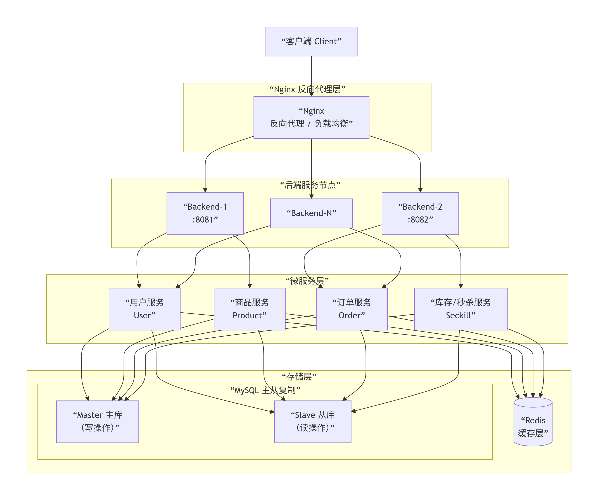
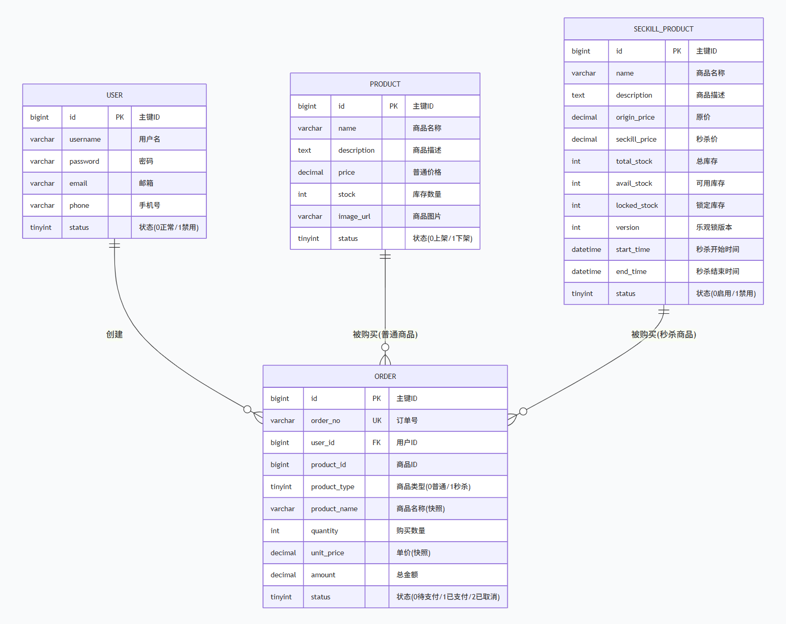

# 第一讲：系统设计与基础框架

## 一、作业要求

- 绘制系统架构草图（服务拆分：用户服务、商品服务、订单服务、库存服务）
- 定义各服务API接口（RESTful）
- 数据库ER图（用户表、商品表、库存表、订单表）
- 技术栈选型说明（编程语言、框架、中间件初选）
- 初始化项目代码仓库（Git）
- 搭建基础开发环境（Spring Boot + MyBatis + MySQL）
- 搭建项目代码框架，实现简单的用户注册登录功能

## 二、系统架构设计

### 2.1 整体架构

本系统采用**前后端分离 + 微服务思想**的单体架构，按业务域在代码层面划分为四个核心服务模块：


### 2.2 服务拆分

| 服务模块 | 职责 | 对应代码位置 |
|---------|------|-------------|
| **用户服务** | 用户注册、登录、JWT认证 | `UserController` / `UserServiceImpl` |
| **商品服务** | 商品列表、详情查询、Redis缓存 | `ProductController` / `ProductServiceImpl` |
| **订单服务** | 普通下单、支付、取消、查询 | `OrderController` / `OrderServiceImpl` |
| **库存服务** | 秒杀商品管理、库存预热、TCC库存扣减 | `SeckillController` / `SeckillProductServiceImpl` / `TccStockParticipant` |
| **TCC 事务协调器** | 分布式事务 Try-Confirm-Cancel 编排 | `TccTransactionCoordinator` |

## 三、RESTful API 接口定义

### 3.1 用户服务 (`/api/user`)

| 方法 | 路径 | 说明 |
|------|------|------|
| POST | `/api/user/register` | 用户注册 |
| POST | `/api/user/login` | 用户登录，返回JWT Token |

### 3.2 商品服务 (`/api/product`)

| 方法 | 路径 | 说明 |
|------|------|------|
| GET | `/api/product/list` | 获取在售商品列表 |
| GET | `/api/product/{id}` | 获取商品详情 |

### 3.3 订单服务 (`/api/order`)

| 方法 | 路径 | 说明 |
|------|------|------|
| POST | `/api/order/place` | 普通商品下单 |
| GET | `/api/order/my` | 查询我的订单 |
| GET | `/api/order/{orderNo}` | 按订单号查询 |
| POST | `/api/order/pay/{no}` | 订单支付 |
| POST | `/api/order/cancel/{no}` | 取消订单（秒杀订单触发 TCC Cancel） |

### 3.4 秒杀服务 (`/api/seckill`)

| 方法 | 路径 | 说明 |
|------|------|------|
| GET | `/api/seckill/list` | 获取秒杀商品列表 |
| GET | `/api/seckill/{id}` | 获取秒杀商品详情 |
| POST | `/api/seckill/do` | 提交秒杀请求 |
| GET | `/api/seckill/order/{spId}` | 查询秒杀订单结果 |
| POST | `/api/seckill/warmup/{id}` | 手动预热库存 |

## 四、数据库ER图

### 4.1 核心表结构



### 4.2 表关系说明

- **user → order**: 一对多（一个用户可以有多个订单）
- **product → order**: 一对多（一个商品可以出现在多个订单中）
- **product → seckill_product**: 一对一（普通商品可对应一个秒杀活动）
- **seckill_product → order**: 一对多（一个秒杀活动可产生多个订单）
- **order.product_type**: 区分普通商品(0)和秒杀商品(1)
- **order.status**: `-1`TCC预留中 / `0`待支付 / `1`已支付 / `2`已取消
- **order.timeout_at**: TCC 超时时间，用于自动取消未支付的秒杀订单

## 五、技术栈选型

| 层次 | 技术 | 版本 | 选型理由 |
|------|------|------|---------|
| **后端框架** | Spring Boot | 3.2.0 | 主流Java Web框架，自动配置、生态丰富 |
| **ORM** | MyBatis | 3.0.3 | 灵活的SQL映射，适合复杂查询场景 |
| **数据库** | MySQL | 8.0 | 成熟稳定，支持主从复制、事务 |
| **缓存** | Redis | 7.x | 高性能内存缓存，支持原子操作 |
| **消息队列** | Apache Kafka | 7.5.0 | 高吞吐量，适合秒杀削峰填谷 |
| **前端框架** | Vue 3 + Element Plus | - | 响应式UI，组件库丰富 |
| **构建工具** | Vite | - | 快速的前端构建工具 |
| **容器化** | Docker + Docker Compose | - | 环境一致性，便于部署 |
| **反向代理** | Nginx | 1.25 | 负载均衡、动静分离 |
| **认证** | JWT (jjwt) | 0.11.5 | 无状态认证，适合分布式场景 |
| **密码加密** | Spring Security Crypto | - | BCryptPasswordEncoder，安全性高 |
| **分布式事务** | TCC（自研） | - | Try-Confirm-Cancel 补偿型事务，保证库存与订单强一致 |
| **定时任务** | Spring Scheduling | - | 每30秒扫描超时秒杀订单，自动执行 TCC Cancel |

## 六、项目代码框架

### 6.1 目录结构

```
seckill-rw/
├── backend/                          # 后端Spring Boot项目
│   ├── src/main/java/com/seckill/
│   │   ├── config/                   # 配置类（数据源、Redis、Kafka、跨域）
│   │   ├── controller/               # 控制器层
│   │   ├── datasource/               # 读写分离数据源路由
│   │   ├── exception/                # 全局异常处理
│   │   ├── mapper/                   # MyBatis Mapper接口
│   │   ├── model/                    # 数据模型（entity/dto/vo）
│   │   ├── service/                  # 服务层
│   │   │   ├── impl/                 # 服务实现
│   │   │   └── tcc/                  # TCC分布式事务参与者与协调器
│   │   ├── task/                     # 定时任务（秒杀订单超时取消）
│   │   └── utils/                    # 工具类（JWT、Redis、雪花算法）
│   └── src/main/resources/
│       ├── application.yml           # 应用配置
│       └── mapper/                   # MyBatis XML映射文件
├── frontend/                         # 前端Vue3项目
│   └── src/
│       ├── api/                      # API请求封装
│       ├── router/                   # 路由配置
│       ├── store/                    # 状态管理
│       └── views/                    # 页面组件
├── mysql/                            # MySQL主从配置
│   ├── master/                       # 主库初始化脚本
│   └── slave/                        # 从库初始化与复制配置
├── nginx/                            # Nginx配置
│   ├── nginx.conf                    # 主配置
│   ├── conf.d/default.conf           # 站点配置
│   └── static/                       # 静态资源
└── docker-compose.yml                # Docker编排文件
```

### 6.2 用户注册登录实现

#### 注册流程

1. 前端提交用户名、密码、手机号
2. 后端校验用户名是否已存在（查主库）
3. 使用 `BCryptPasswordEncoder` 对密码进行加密
4. 将用户信息写入主库 MySQL
5. 返回注册成功结果

**关键代码**（`UserServiceImpl.java`）：

```java
// 检查用户名是否已存在
if (userMapper.findByUsername(dto.getUsername()) != null) {
    throw new RuntimeException("用户名已存在");
}
// BCrypt加密密码
String encodedPassword = bCryptPasswordEncoder.encode(dto.getPassword());
user.setPassword(encodedPassword);
// 写入主库
userMapper.insert(user);
```

#### 登录流程

1. 前端提交用户名、密码
2. 后端根据用户名查询用户（查主库）
3. 使用 `BCryptPasswordEncoder.matches()` 校验密码
4. 签发 JWT Token（有效期24小时）
5. 返回 Token 给前端，后续请求携带 Token 进行认证

**关键代码**（`UserServiceImpl.java`）：

```java
User user = userMapper.findByUsername(dto.getUsername());
if (user == null || !bCryptPasswordEncoder.matches(dto.getPassword(), user.getPassword())) {
    throw new RuntimeException("用户名或密码错误");
}
String token = JwtUtils.generateToken(user.getId(), user.getUsername());
```

#### JWT 认证机制

- 算法：HS256
- 载荷：用户ID、用户名
- 过期时间：24小时
- 前端将 Token 存储在 localStorage，每次请求通过 `Authorization: Bearer <token>` 头传递
