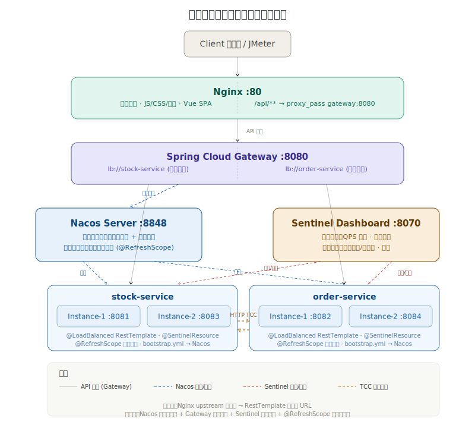
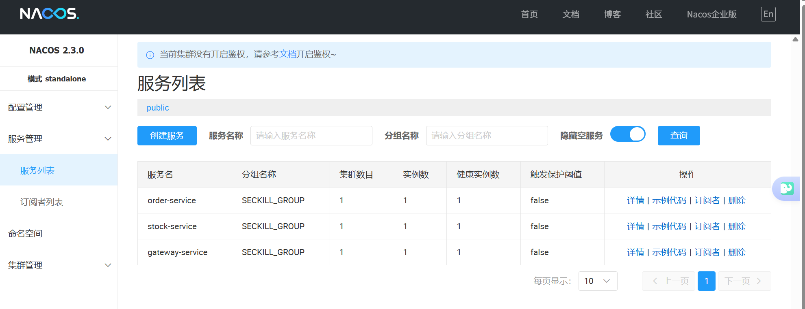
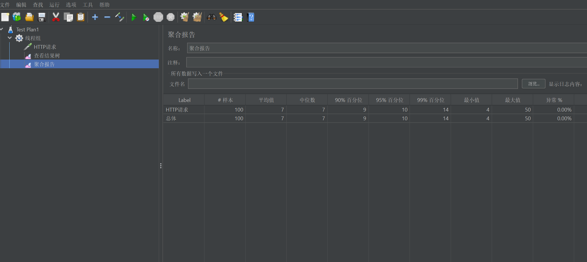
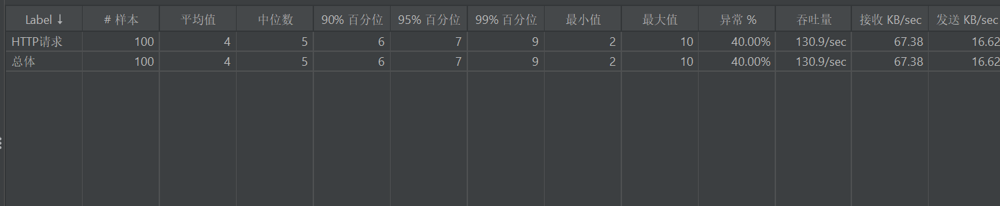
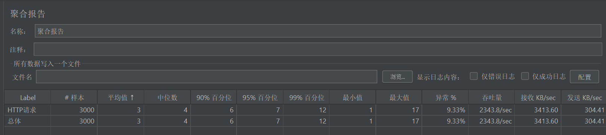
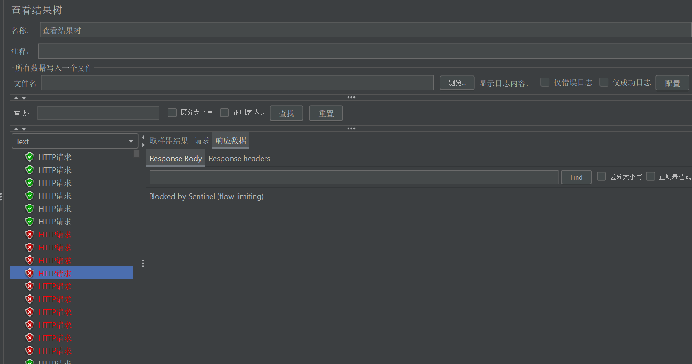
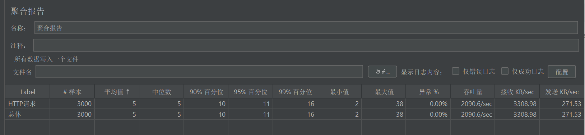

# 第七讲：服务治理与流量控制

## 一、作业要求

### 具体要求
1. 搭建 Nacos 环境实现服务注册、配置管理，结合 Spring Cloud Gateway 服务网关
2. 使用网关地址调用服务，测试动态服务路由的正确性
3. 在代码中使用 Nacos 的属性，测试动态更新属性能力
4. 对服务进行设置熔断、限流和降级
5. 使用 JMeter 进行压力测试，测试流量治理的效果

## 二、版本选型

| 组件 | 版本 | 说明 |
|------|------|------|
| Spring Boot | 3.2.0 | 保持不变 |
| Spring Cloud | 2023.0.1 (Kilburn) | 适配 Boot 3.2.x |
| Spring Cloud Alibaba | 2023.0.1.0 | 适配 Cloud 2023.0.x |
| Nacos Server | v2.3.0 | 注册中心 + 配置中心 |
| Spring Cloud Gateway | 由 Cloud BOM 管理 | 基于 WebFlux |
| Sentinel Dashboard | 1.8.6 | 流量治理控制台 |

## 三、架构变化

### 3.1 改造前
```
客户端 → Nginx(80) → stock-service(8081/8083)
                   → order-service(8082/8084)
服务间调用：RestTemplate + 硬编码 URL
```

### 3.2 改造后
```
客户端 → Nginx(80) → Spring Cloud Gateway(8080) → [Nacos发现] → stock-service
                                              → [Nacos发现] → order-service
Nacos Server(8848)：服务注册中心 + 配置中心
Sentinel Dashboard(8070)：熔断、限流、降级管理
```

### 3.3 架构图


### 3.4 nacos截图



## 四、JMeter 压力测试指南

### 4.1 测试环境准备

1. 启动所有服务：
   ```bash
   docker-compose up -d
   ```
2. 等待所有服务健康（约 30 秒），确认 Nacos 中已注册服务：
   - 访问 `http://localhost:8848/nacos` → 服务管理 → 服务列表
   - 应看到 `stock-service`、`order-service`、`gateway-service`
3. 确认 Gateway 路由正常：
   ```bash
   curl http://localhost:8080/api/seckill/list
   ```

### 4.2 JMeter 测试计划

#### 测试一：动态服务路由验证

**目的**：验证请求通过 Gateway 正确路由到不同服务。

| 参数 | 值 |
|------|-----|
| 线程组 | 10 线程，循环 10 次 |
| HTTP 请求 | GET `http://localhost:8080/api/seckill/list` |
| HTTP 请求 | GET `http://localhost:8080/api/order/` + 订单号 |

**验证点**：
- 响应码 200
- 响应体包含正确的数据
- Nginx 日志显示请求转发到 gateway-service




#### 测试二：Sentinel 限流效果验证

**目的**：验证 QPS 限流是否生效。

**步骤**：
1. 在 Sentinel Dashboard 中为 `/api/seckill/1` 设置 QPS = 5
2. 在 JMeter 中配置：
   - 线程组：2 线程，循环 50 次（总计 5000 请求）
   - HTTP 请求：`POST http://localhost:8080/api/seckill/1`
   - Header：`Authorization: Bearer <token>`
   - Body：`{"seckillProductId": 1, "quantity": 1}`
3. 添加"聚合报告"监听器

**预期结果**：


- 正常请求返回 200 或业务错误码
- 被限流的请求返回 429 `"系统繁忙，请稍后重试"`

#### 测试三：Sentinel 熔断效果验证

**目的**：验证当服务慢调用比例过高时，Sentinel 自动熔断并快速返回降级响应。

**原理**：当某资源在统计窗口内的慢调用比例（响应时间超过 RT 阈值的请求占比）超过阈值时，Sentinel 会自动打开熔断器，后续请求不再执行业务逻辑，直接返回降级响应，直到熔断恢复。

**步骤**：
1. 先访问一次接口，让 Sentinel 识别资源：
   ```bash
   curl http://localhost:8080/api/seckill/list
   ```
2. 在 Sentinel Dashboard 中配置熔断规则：
   - 打开 `http://localhost:8070` → **降级规则** → 新增
   - 资源名：`/seckill/list`
   - 策略：**慢调用比例**
   - RT 阈值：**1**（毫秒，响应时间超过 1ms 算慢调用）
   - 慢调用比例阈值：**0.5**（50%）
   - 熔断时长：**10**（秒）
   - 统计时长：**1**（秒）
   - 最小请求数：**5**
3. 在 JMeter 中配置：
   - 线程组：30 线程，循环 100 次（总计 3000 请求）
   - HTTP 请求：`GET http://localhost:8080/api/seckill/list`
   - 无需认证 Header
4. 添加"聚合报告"监听器

**启动熔断的效果**


- 异常率为9.33%
- http请求报错

**不启动熔断的效果**


### 4.3 JMeter 测试计划创建步骤

1. 打开 JMeter → 新建测试计划
2. 右键测试计划 → 添加 → 线程（用户）→ 线程组
3. 配置线程组参数（线程数、Ramp-Up、循环次数）
4. 右键线程组 → 添加 → 取样器 → HTTP 请求
5. 配置服务器名称、端口、路径、方法
6. 右键线程组 → 添加 → 监听器 → 查看结果树
7. 右键线程组 → 添加 → 监听器 → 聚合报告
8. 如需认证，右键线程组 → 添加 → 配置元件 → HTTP 信息头管理器
   - 添加 Header：`Authorization` = `Bearer <your_token>`
9. 点击运行 → 查看结果

### 4.4 预期测试结论

1. **路由正确性**：Gateway 能将请求正确路由到对应的微服务
2. **限流效果**：超过 QPS 阈值的请求被 Sentinel 拦截，返回 429
3. **熔断效果**：慢调用比例超过阈值后，Sentinel 自动熔断，后续请求直接返回降级响应，响应时间明显缩短（从几十ms降到1ms以下）

## 五、实现详解

### 5.1 Nacos 注册中心

#### Docker 部署
`docker-compose.yml` 中新增 Nacos 容器：

```yaml
nacos:
  image: nacos/nacos-server:v2.3.0
  container_name: seckill-nacos
  ports:
    - "8848:8848"
    - "9848:9848"
    - "9849:9849"
  environment:
    MODE: standalone
```

#### 服务注册配置
每个微服务添加 `bootstrap.yml`：

```yaml
spring:
  cloud:
    nacos:
      discovery:
        server-addr: ${NACOS_SERVER_ADDR:localhost:8848}
        group: SECKILL_GROUP
      config:
        server-addr: ${NACOS_SERVER_ADDR:localhost:8848}
        file-extension: yml
        shared-configs:
          - data-id: seckill-common.yml
            group: SECKILL_GROUP
            refresh: true
```

#### Maven 依赖
```xml
<dependency>
    <groupId>com.alibaba.cloud</groupId>
    <artifactId>spring-cloud-starter-alibaba-nacos-discovery</artifactId>
</dependency>
<dependency>
    <groupId>com.alibaba.cloud</groupId>
    <artifactId>spring-cloud-starter-alibaba-nacos-config</artifactId>
</dependency>
<dependency>
    <groupId>org.springframework.cloud</groupId>
    <artifactId>spring-cloud-starter-bootstrap</artifactId>
</dependency>
```

### 5.2 Spring Cloud Gateway 网关

#### 新建 gateway-service 模块
**文件**：`gateway-service/src/main/java/com/seckill/gateway/GatewayApplication.java`

```java
@SpringBootApplication
public class GatewayApplication {
    public static void main(String[] args) {
        SpringApplication.run(GatewayApplication.class, args);
    }
}
```

#### 路由配置
**文件**：`gateway-service/src/main/resources/bootstrap.yml`

```yaml
spring:
  cloud:
    gateway:
      discovery:
        locator:
          enabled: true
          lower-case-service-id: true
      routes:
        - id: stock-service
          uri: lb://stock-service
          predicates:
            - Path=/api/seckill/**, /api/product/**, /api/stock/**, /api/config/**
        - id: order-service
          uri: lb://order-service
          predicates:
            - Path=/api/order/**, /api/user/**
```

`lb://` 表示通过 Nacos 服务发现进行负载均衡。

### 5.3 服务间调用改造

#### RestTemplate 负载均衡
将 `@LoadBalanced` 注解添加到 RestTemplate Bean：

```java
@Configuration
public class RestTemplateConfig {
    @Bean
    @LoadBalanced
    public RestTemplate restTemplate() {
        return new RestTemplate();
    }
}
```

#### URL 改为服务名
**改造前**（硬编码）：
```java
@Value("${order-service.url}")  // http://localhost:8082
private String orderServiceUrl;
String url = orderServiceUrl + "/api/order/internal/...";
```

**改造后**（服务发现）：
```yaml
# application.yml
order-service:
  url: http://order-service  # 服务名，非IP
```

Nacos 自动将 `order-service` 解析为实际可用实例地址。

### 5.4 Nacos 配置动态更新

#### 演示 Controller
**文件**：`stock-service/src/main/java/.../controller/ConfigController.java`

```java
@RestController
@RequestMapping("/config")
@RefreshScope  // 关键：支持 Nacos 配置热更新
public class ConfigController {

    @Value("${seckill-demo.greeting:Hello from stock-service}")
    private String greeting;

    @GetMapping("/info")
    public ResultVO<Map<String, Object>> info() {
        Map<String, Object> data = new HashMap<>();
        data.put("greeting", greeting);
        return ResultVO.success(data);
    }
}
```

#### 测试步骤
1. 启动服务后访问 `GET http://localhost:8080/api/config/info`
2. 登录 Nacos 控制台 `http://localhost:8848/nacos`（账号密码：nacos/nacos）
3. 在 配置管理 → 配置列表 中新建配置：
   - Data ID: `seckill-common.yml`
   - Group: `SECKILL_GROUP`
   - 内容：
     ```yaml
     seckill-demo:
       greeting: "Updated from Nacos!"
       rate-limit: 200
     ```
4. 保存后再次访问 `/api/config/info`，观察返回值变化（无需重启服务）

### 5.5 Sentinel 熔断、限流、降级

#### 依赖配置
```xml
<dependency>
    <groupId>com.alibaba.cloud</groupId>
    <artifactId>spring-cloud-starter-alibaba-sentinel</artifactId>
</dependency>
```

#### application.yml 配置
```yaml
spring:
  cloud:
    sentinel:
      transport:
        dashboard: ${SENTINEL_DASHBOARD:localhost:8070}
        port: 8719
```

#### 控制器注解方式
**文件**：`SeckillController.java`

```java
@PostMapping("/do")
@SentinelResource(value = "seckill-do",
        blockHandler = "doSeckillBlockHandler",
        fallback = "doSeckillFallback")
public ResultVO<Map<String, Object>> doSeckill(...) {
    // 正常业务逻辑
}

// 限流回调
public ResultVO<Map<String, Object>> doSeckillBlockHandler(
        SeckillRequestDTO dto, HttpServletRequest request, BlockException ex) {
    return ResultVO.fail(429, "系统繁忙，请稍后重试");
}

// 降级回调
public ResultVO<Map<String, Object>> doSeckillFallback(
        SeckillRequestDTO dto, HttpServletRequest request, Throwable t) {
    return ResultVO.fail(503, "服务降级，请稍后再试");
}
```

**文件**：`OrderController.java`

```java
@PostMapping("/place")
@SentinelResource(value = "order-place",
        blockHandler = "placeBlockHandler",
        fallback = "placeFallback")
public ResultVO<Order> place(...) { ... }

@PostMapping("/pay/{orderNo}")
@SentinelResource(value = "order-pay",
        blockHandler = "payBlockHandler",
        fallback = "payFallback")
public ResultVO<Order> pay(...) { ... }
```

#### Sentinel 控制台配置流控规则
启动后访问 `http://localhost:8070`（账号密码：sentinel/sentinel），在 流控规则 中添加：

| 资源名 | 阈值类型 | 单机阈值 | 流控效果 |
|--------|---------|---------|---------|
| seckill-do | QPS | 100 | 快速失败 |
| order-place | QPS | 50 | 快速失败 |
| order-pay | QPS | 80 | 快速失败 |

### 5.6 Nginx 改造

将动态 API 路由从分别代理两个 upstream 改为统一代理到 Gateway：

```nginx
# 改造前：两个独立 upstream
upstream stock_cluster { server stock-service-1:8081; stock-service-2:8081; }
upstream order_cluster { server order-service-1:8082; order-service-2:8082; }

# 改造后：统一到 Gateway
upstream gateway_cluster { server gateway-service:8080; }

location ~ ^/api/ {
    proxy_pass http://gateway_cluster;
    ...
}
```

## 六、改动文件清单

| 文件 | 操作 | 说明 |
|------|------|------|
| `stock-service/pom.xml` | 修改 | 添加 Nacos + Sentinel + Bootstrap 依赖 |
| `order-service/pom.xml` | 修改 | 同上 |
| `stock-service/.../bootstrap.yml` | 新建 | Nacos 连接配置 |
| `order-service/.../bootstrap.yml` | 新建 | Nacos 连接配置 |
| `stock-service/.../application.yml` | 修改 | 添加 sentinel 配置，URL 改服务名 |
| `order-service/.../application.yml` | 修改 | 同上 |
| `stock-service/.../RestTemplateConfig.java` | 修改 | 添加 @LoadBalanced |
| `order-service/.../RestTemplateConfig.java` | 修改 | 同上 |
| `stock-service/.../SeckillController.java` | 修改 | 添加 @SentinelResource |
| `order-service/.../OrderController.java` | 修改 | 添加 @SentinelResource |
| `stock-service/.../ConfigController.java` | 新建 | Nacos 配置动态更新演示 |
| `order-service/.../ConfigController.java` | 新建 | Nacos 配置动态更新演示 |
| `gateway-service/` | 新建模块 | pom.xml + Dockerfile + Application + bootstrap.yml |
| `docker-compose.yml` | 修改 | 添加 nacos、sentinel、gateway-service |
| `nginx/conf.d/default.conf` | 修改 | API 路由改为 gateway |
