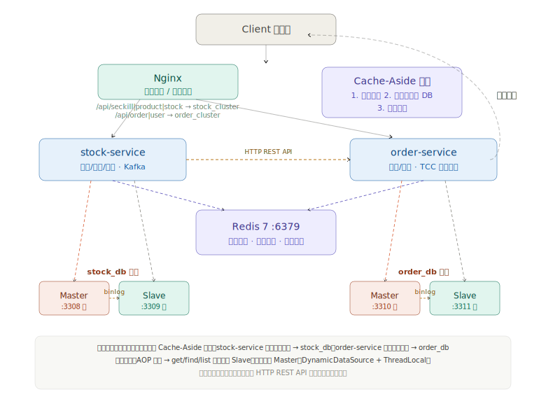
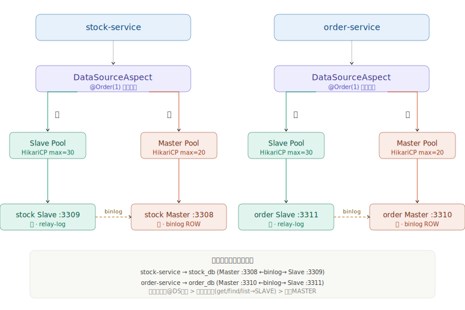

# 第三讲：高并发读 —— 分布式缓存与读写分离

## 一、作业要求

### 分布式缓存
- 引入 Redis，实现商品详情页缓存
- 处理缓存穿透、击穿、雪崩问题

### 读写分离
- 搭建 MySQL 的读写分离环境，在代码中测试读写分离效果

## 二、Redis 分布式缓存详解

### 2.1 缓存架构



### 2.2 缓存 Key 设计

| Key 模式 | 示例 | TTL | 用途 |
|---------|------|-----|------|
| `product:list` | `product:list` | 300±60秒 | 在售商品列表 |
| `product:detail:{id}` | `product:detail:1` | 1800±300秒 | 单个商品详情 |
| `lock:product:{id}` | `lock:product:1` | 10秒 | 商品详情缓存重建锁 |
| `seckill:stock:{id}` | `seckill:stock:1` | 24小时 | 秒杀商品库存（Redis预扣减） |
| `seckill:user:{uid}:sp:{sid}` | `seckill:user:1001:sp:1` | 24小时 | 用户秒杀幂等标记 |

### 2.3 缓存穿透防护（查询不存在的数据）

**场景**：恶意请求大量不存在的商品ID（如 id=-1, id=999999），每次请求都穿透到数据库。

**方案**：缓存空值 + 短 TTL

```java
// ProductServiceImpl.java - getById()
Product product = productMapper.findById(id);

if (product == null) {
    // 将 "NULL" 字符串写入缓存，TTL=300秒
    redisUtils.set(key, "NULL", NULL_TTL, TimeUnit.SECONDS);
    return null;
}

// 读取时判断
if ("NULL".equals(cached)) {
    // 命中空值缓存，直接返回null，不查数据库
    return null;
}
```

**效果**：不存在的ID在第一次查询后会被缓存300秒，后续相同请求直接命中缓存返回，保护数据库。

### 2.4 缓存击穿防护（热点 key 过期）

**场景**：某个热门商品的缓存过期，大量并发请求同时到达，全部穿透到数据库。

**方案**：Redis 分布式互斥锁（SETNX）

```java
// ProductServiceImpl.java - getById()
String lockKey = "lock:product:" + id;

// 尝试获取分布式锁（10秒自动过期，防止死锁）
boolean locked = redisUtils.setIfAbsent(lockKey, "1", LOCK_TTL, TimeUnit.SECONDS);

if (!locked) {
    // 没抢到锁的线程等待50ms后重试（递归调用）
    Thread.sleep(50);
    return getById(id);
}

try {
    // 抢到锁后再次检查缓存（双重检查，防止其他线程已重建）
    cached = redisUtils.get(key);
    if (cached != null) return parseCached(cached);

    // 只有一个线程查询数据库并回写缓存
    Product product = productMapper.findById(id);
    redisUtils.set(key, serialize(product), ttl, TimeUnit.SECONDS);
    return product;
} finally {
    redisUtils.delete(lockKey);  // 释放锁
}
```

**流程图**：

```
请求1 ──→ 缓存未命中 ──→ 获取锁成功 ──→ 查DB ──→ 写缓存 ──→ 返回
请求2 ──→ 缓存未命中 ──→ 获取锁失败 ──→ 等待50ms ──→ 重试 ──→ 命中缓存 ──→ 返回
请求3 ──→ 缓存未命中 ──→ 获取锁失败 ──→ 等待50ms ──→ 重试 ──→ 命中缓存 ──→ 返回
```

### 2.5 缓存雪崩防护（大量 key 同时过期）

**场景**：系统重启或大量商品在同一时间写入缓存，导致它们在同一时刻过期，数据库瞬间压力暴增。

**方案**：TTL 随机抖动

```java
// 商品列表：基础TTL=300秒，随机偏移±60秒 → 实际TTL在240~360秒之间
long listTtl = LIST_TTL + new Random().nextInt(120) - 60;
redisUtils.set(PRODUCT_LIST_KEY, json, listTtl, TimeUnit.SECONDS);

// 商品详情：基础TTL=1800秒，随机偏移±300秒 → 实际TTL在1500~2100秒之间
long detailTtl = DETAIL_TTL + new Random().nextInt(600) - 300;
redisUtils.set(key, json, detailTtl, TimeUnit.SECONDS);
```

**效果**：即使所有商品同时被首次访问，它们的缓存也会在不同时间过期，分散数据库压力。

### 2.6 三种防护方案对比

| 问题 | 根本原因 | 解决方案 | 实现要点 |
|------|---------|---------|---------|
| 缓存穿透 | 查询不存在的数据 | 缓存空值 | 将"NULL"字符串缓存，短TTL(300s) |
| 缓存击穿 | 热点key过期瞬间高并发 | 互斥锁 | SETNX加锁，只有一个线程重建缓存 |
| 缓存雪崩 | 大量key同时过期 | TTL随机抖动 | TTL = 基础值 ± 随机偏移 |

## 三、MySQL 读写分离

### 3.1 架构设计




### 3.2 实现方案

本项目采用**自定义 AOP + AbstractRoutingDataSource** 实现读写分离（未使用 ShardingSphere）。

#### 3.2.1 数据源配置（DataSourceConfig.java）

两个微服务各自配置独立的 HikariCP 连接池，分别连接自己的主库和从库：

**stock-service 的数据源配置：**

```java
@Bean("masterDataSource")
public DataSource masterDataSource() {
    HikariDataSource ds = new HikariDataSource();
    ds.setJdbcUrl(masterUrl);      // jdbc:mysql://stock-mysql-master:3306/stock_db
    ds.setUsername("stock");        // 主库用户（读写权限）
    ds.setMaximumPoolSize(20);
    return ds;
}

@Bean("slaveDataSource")
public DataSource slaveDataSource() {
    HikariDataSource ds = new HikariDataSource();
    ds.setJdbcUrl(slaveUrl);       // jdbc:mysql://stock-mysql-slave:3306/stock_db
    ds.setUsername("stock_ro");     // 从库用户（只读权限）
    ds.setMaximumPoolSize(30);      // 读连接池更大（读多写少）
    return ds;
}
```

**order-service 的数据源配置：**

```java
@Bean("masterDataSource")
public DataSource masterDataSource() {
    HikariDataSource ds = new HikariDataSource();
    ds.setJdbcUrl(masterUrl);      // jdbc:mysql://order-mysql-master:3306/order_db
    ds.setUsername("order_user");   // 主库用户（读写权限）
    ds.setMaximumPoolSize(20);
    return ds;
}

@Bean("slaveDataSource")
public DataSource slaveDataSource() {
    HikariDataSource ds = new HikariDataSource();
    ds.setJdbcUrl(slaveUrl);       // jdbc:mysql://order-mysql-slave:3306/order_db
    ds.setUsername("order_ro");     // 从库用户（只读权限）
    ds.setMaximumPoolSize(30);      // 读连接池更大（读多写少）
    return ds;
}
```

#### 3.2.2 动态数据源路由（DynamicDataSource.java）

继承 Spring 的 `AbstractRoutingDataSource`，根据 ThreadLocal 上下文决定使用哪个数据源：

```java
public class DynamicDataSource extends AbstractRoutingDataSource {
    @Override
    protected Object determineCurrentLookupKey() {
        return DataSourceContextHolder.get();
    }
}
```

#### 3.2.3 AOP 切面（DataSourceAspect.java）

两个微服务各自拦截自己的 Service 方法，按优先级决定数据源：

```java
// stock-service 的切面
@Around("execution(* com.seckill.stock.service..*(..))")
public Object around(ProceedingJoinPoint pjp) throws Throwable {
    DataSourceType type = resolveDataSourceType(pjp);
    DataSourceContextHolder.set(type);
    try {
        return pjp.proceed();
    } finally {
        DataSourceContextHolder.clear();
    }
}

// order-service 的切面
@Around("execution(* com.seckill.order.service..*(..))")
public Object around(ProceedingJoinPoint pjp) throws Throwable {
    DataSourceType type = resolveDataSourceType(pjp);
    DataSourceContextHolder.set(type);
    try {
        return pjp.proceed();
    } finally {
        DataSourceContextHolder.clear();
    }
}
```

**路由优先级**：

| 优先级 | 规则 | 示例 |
|-------|------|------|
| 1 | 方法上的 `@DS` 注解 | `@DS(DataSourceType.SLAVE)` |
| 2 | 类上的 `@DS` 注解 | 类级别注解 |
| 3 | 方法名约定 | `get/find/list/query/count/select/fetch/load/search` 开头 → SLAVE |
| 4 | 兜底 | 默认 MASTER |

#### 3.2.4 @DS 自定义注解

```java
@Target({ElementType.METHOD, ElementType.TYPE})
@Retention(RetentionPolicy.RUNTIME)
public @interface DS {
    DataSourceType value() default DataSourceType.MASTER;
}
```

### 3.3 读写分离在业务中的应用

**stock-service（库存服务）：**

| 业务场景 | 数据源 | 实现方式 |
|---------|-------|---------|
| 商品列表查询 | SLAVE | 方法名 `listOnSale` 匹配约定 |
| 商品详情查询 | SLAVE | 方法名 `getById` 匹配约定 |
| 库存扣减 | MASTER | `@DS(MASTER)` 显式指定 |
| TCC 库存预留 | MASTER | `@DS(MASTER)` + `@Transactional` |

**order-service（订单服务）：**

| 业务场景 | 数据源 | 实现方式 |
|---------|-------|---------|
| 用户注册（写） | MASTER | 方法名 `register` 无读前缀，走主库 |
| 用户登录 | MASTER | `@DS(MASTER)` 显式指定，保证一致性 |
| 秒杀订单创建（TCC Try） | MASTER | `@DS(MASTER)` + `@Transactional` |
| 秒杀订单支付（TCC Confirm） | MASTER | `@DS(MASTER)` + `@Transactional` |
| 我的订单查询 | MASTER | `@DS(MASTER)` 显式指定，避免主从延迟导致查不到刚下的订单 |
| 订单详情查询 | SLAVE | 方法名 `getByOrderNo` 匹配约定 |

### 3.4 AOP 切面与事务的执行顺序

```java
@Order(1)  // 确保在事务切面之前执行
public class DataSourceAspect { ... }
```

**为什么重要**：`@Order(1)` 保证数据源路由在事务开启之前确定。如果事务先开启，再切换数据源，会导致事务连接和实际使用的连接不一致，造成事务失效。

### 3.5 MySQL 主从复制配置

两组独立的 MySQL 主从集群，各自配置不同的 server-id。

#### stock_db 主库配置

```ini
[mysqld]
server-id=10
log-bin=mysql-bin
binlog-format=ROW
binlog-row-image=FULL
```

#### stock_db 从库配置

```ini
[mysqld]
server-id=11
relay-log=relay-bin
log-slave-updates=ON
read-only=ON
```

#### order_db 主库配置

```ini
[mysqld]
server-id=20
log-bin=mysql-bin
binlog-format=ROW
binlog-row-image=FULL
```

#### order_db 从库配置

```ini
[mysqld]
server-id=21
relay-log=relay-bin
log-slave-updates=ON
read-only=ON
```

#### 复制配置

```bash
# stock_db 从库执行
CHANGE MASTER TO
    MASTER_HOST='stock-mysql-master',
    MASTER_PORT=3306,
    MASTER_USER='repl',
    MASTER_PASSWORD='repl123',
    MASTER_AUTO_POSITION=1;
START SLAVE;

# order_db 从库执行
CHANGE MASTER TO
    MASTER_HOST='order-mysql-master',
    MASTER_PORT=3306,
    MASTER_USER='repl',
    MASTER_PASSWORD='repl123',
    MASTER_AUTO_POSITION=1;
START SLAVE;
```

### 3.6 读写分离验证

验证方法：分别调用读/写接口，观察日志中输出的 `[RW-Split] xxx → SLAVE` 或 `[RW-Split] xxx → MASTER` 标记。

**stock-service 验证：**
- 调用 `GET /api/product/list`（商品列表），日志应显示路由到 `stock Slave :3309`
- 调用 `POST /api/seckill/do`（秒杀下单），日志应显示路由到 `stock Master :3308`

**order-service 验证：**
- 调用 `GET /api/order/detail/{orderNo}`（订单详情），日志应显示路由到 `order Slave :3311`
- 调用 `POST /api/order/place`（下单），日志应显示路由到 `order Master :3310`

## 四、总结

### 4.1 高并发读优化全景

```
用户请求
  │
  ├──→ Nginx静态资源 ──→ 直接返回（~1ms）
  │
  ├──→ Nginx代理 /api/(seckill|product|stock)/ ──→ stock-service 集群
  │                                                      │
  │                                                      ├──→ Redis缓存命中 ──→ 返回（~5ms）
  │                                                      │
  │                                                      └──→ Redis缓存未命中
  │                                                               │
  │                                                               ├──→ 获取分布式锁
  │                                                               │
  │                                                               └──→ stock_db从库查询 ──→ 回写Redis ──→ 返回（~50ms）
  │
  └──→ Nginx代理 /api/(order|user)/ ──→ order-service 集群
                                                      │
                                                      ├──→ Redis缓存命中 ──→ 返回（~5ms）
                                                      │
                                                      └──→ Redis缓存未命中
                                                               │
                                                               ├──→ 获取分布式锁
                                                               │
                                                               └──→ order_db从库查询 ──→ 回写Redis ──→ 返回（~50ms）
```

### 4.2 核心优化手段

| 优化层次 | 手段 | 效果 |
|---------|------|------|
| 接入层 | Nginx动静分离 | 静态资源不经过后端，响应时间从50ms降至1ms |
| 接入层 | Nginx负载均衡 | 多实例水平扩展，吞吐量成倍提升 |
| 缓存层 | Redis Cache-Aside | 热点数据内存访问，响应时间从50ms降至5ms |
| 缓存层 | 穿透/击穿/雪崩防护 | 保护数据库不被异常请求打垮 |
| 数据层 | MySQL读写分离 | 读流量分散到从库，主库专注写入（stock_db + order_db 各自主从） |
| 数据层 | 从库连接池更大(30 vs 20) | 匹配读多写少的业务特征 |
| 微服务层 | 独立数据库集群 | stock-service→stock_db，order-service→order_db，互不干扰 |
