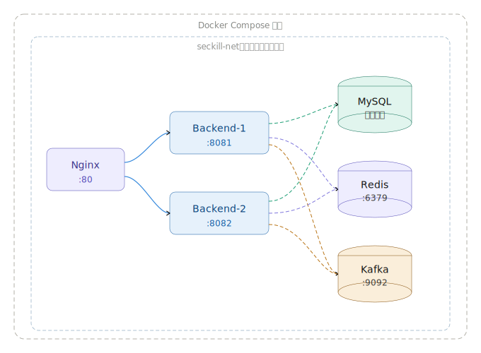

# 第二讲：高并发读 —— 容器化、负载均衡、动静分离与分布式缓存

## 一、作业要求

### 容器环境
- 配置项目的 Dockerfile 和 docker-compose 文件，将数据库、后端服务、Nginx 分别使用容器进行启动加载

### 负载均衡
- 后端服务启动多个实例分别开启不同 Rest 端口（如 8081 和 8082 端口），通过 Nginx（如 80 端口）进行代理和转发
- 尝试为 Nginx 配置不同的负载均衡算法
- 使用 JMeter 进行压力测试，观察响应时间，验证各后端处理的请求数是否大致相等

### 动静分离
- 写一个简单的前端 Html 文件，可以包括 css、js 等，在 Nginx 中配置动静分离
- 使用 JMeter 分别压测静态文件和后端服务，观察响应时间

### 分布式缓存
- 引入 Redis 缓存，实现商品详情页缓存
- 处理缓存穿透、击穿、雪崩问题

## 二、Docker 容器化配置

### 2.1 服务编排架构

系统通过 `docker-compose.yml` 编排了 7 个服务容器：


### 2.2 后端 Dockerfile（多阶段构建）

采用**多阶段构建**优化镜像体积：

```dockerfile
# 第一阶段：Maven构建
FROM maven:3.9-eclipse-temurin-17-alpine AS builder
WORKDIR /build
COPY pom.xml .
RUN mvn dependency:go-offline -B
COPY src ./src
RUN mvn package -DskipTests -B

# 第二阶段：精简运行镜像
FROM eclipse-temurin:17-jre-alpine
WORKDIR /app
COPY --from=builder /build/target/*.jar app.jar
EXPOSE 8080
ENTRYPOINT ["java", "-jar", "app.jar"]
```

**优点**：
- 构建阶段使用完整 Maven 镜像，运行阶段仅需 JRE
- 最终镜像体积从 ~800MB 缩减至 ~200MB
- 依赖层缓存，代码变更时只需重新构建最后一层

### 2.3 docker-compose.yml 核心配置

| 服务 | 镜像 | 端口映射 | 关键配置 |
|------|------|---------|---------|
| mysql-master | mysql:8.0 | 3306:3306 | binlog ROW格式, server-id=1 |
| mysql-slave | mysql:8.0 | 3307:3306 | relay-log, read-only, server-id=2 |
| redis | redis:7-alpine | 6379:6379 | AOF持久化, 密码认证 |
| kafka | confluentinc/cp-kafka:7.5.0 | 9092:9092 | KRaft模式, 无需ZooKeeper |
| backend-1 | 构建自backend/ | 8081:8080 | 连接主从库+Redis+Kafka |
| backend-2 | 构建自backend/ | 8082:8080 | 同上 |
| nginx | nginx:1.25-alpine | 80:80 | 反代+负载均衡+静态服务 |

**启动顺序保障**：通过 `depends_on` + `condition: service_healthy` 确保依赖服务健康后再启动。

### 2.4 环境变量管理

所有敏感配置通过 `.env` 文件管理：

```env
MYSQL_ROOT_PASSWORD=root123
MYSQL_PASSWORD=seckill123
SLAVE_PASSWORD=seckill_ro123
REDIS_PASSWORD=redis123
JWT_SECRET=seckill-jwt-secret-key-2024-very-long-string
```

## 三、Nginx 负载均衡

### 3.1 负载均衡配置

在 `nginx/conf.d/default.conf` 中配置 upstream 后端集群：

```nginx
upstream backend_cluster {
    server backend-1:8080;
    server backend-2:8080;
}
```

### 3.2 支持的负载均衡算法

系统预留了多种算法的配置注释，可根据需要切换：

| 算法 | 配置方式 | 特点 |
|------|---------|------|
| **轮询（默认）** | `server backend-1:8080; server backend-2:8080;` | 请求均匀分配到各实例 |
| **加权轮询** | `server backend-1:8080 weight=3; server backend-2:8080 weight=1;` | 按权重分配，适合机器配置不同时 |
| **IP Hash** | `ip_hash;` | 同一IP请求固定到同一实例，适合会话保持 |
| **最少连接** | `least_conn;` | 优先分配给当前连接数最少的实例 |

### 3.3 反向代理配置

```nginx
location /api/ {
    proxy_pass         http://backend_cluster;
    proxy_http_version 1.1;
    proxy_set_header   Connection "";
    proxy_set_header   Host $host;
    proxy_set_header   X-Real-IP $remote_addr;
    proxy_set_header   X-Forwarded-For $proxy_add_x_forwarded_for;

    # 失败自动切换到下一个后端
    proxy_next_upstream error timeout http_502 http_503;
    proxy_next_upstream_tries 2;
}
```

**关键特性**：
- `proxy_next_upstream`：当一个后端返回错误/超时时，自动转发到下一个后端，实现故障转移
- `X-Real-IP` / `X-Forwarded-For`：传递客户端真实IP
- 自定义日志格式包含 `upstream_addr`，便于验证负载均衡效果

### 3.4 验证负载均衡

Nginx 日志格式包含 `$upstream_addr`，压测后可通过日志分析各后端实例收到的请求数：

```nginx
log_format main '$remote_addr - $remote_user [$time_local] '
                '"$request" $status $body_bytes_sent '
                '"$http_referer" "$http_user_agent" '
                'upstream=$upstream_addr rt=$request_time';
```

## 四、动静分离

### 4.1 设计思路

将静态资源（HTML、CSS、JS、图片）和动态API请求分离处理：

- **静态资源**：由 Nginx 直接返回，设置强缓存头，不经过后端
- **动态请求**：代理到后端 Spring Boot 服务

### 4.2 Nginx 配置

```nginx
# HTML 文件 —— 不缓存，保证版本最新
location = / {
    root /usr/share/nginx/html;
    index index.html;
    add_header Cache-Control "no-cache, no-store, must-revalidate";
}

# JS/CSS 文件 —— 强缓存30天（Vite打包文件名含hash，内容变化则文件名变化）
location ~* \.(js|css)$ {
    root /usr/share/nginx/html;
    expires 30d;
    add_header Cache-Control "public, max-age=2592000, immutable";
    access_log off;
}

# 商品图片 —— 缓存90天
location ^~ /static/images/ {
    alias /usr/share/nginx/static/images/;
    expires 90d;
    add_header Cache-Control "public, max-age=7776000, immutable";
    access_log off;
}

# API 动态请求 —— 代理到后端，禁止缓存
location /api/ {
    proxy_pass http://backend_cluster;
    add_header Cache-Control "no-store";
}
```

### 4.3 缓存策略总结

| 资源类型 | 缓存策略 | 缓存时间 | 理由 |
|---------|---------|---------|------|
| HTML | 不缓存 | 0 | 保证用户始终获取最新页面 |
| JS/CSS | 强缓存 + immutable | 30天 | Vite文件名含content hash，安全长期缓存 |
| 图片 | 强缓存 | 90天 | 商品图片变化频率低 |
| API | 不缓存 | 0 | 动态数据需要实时性 |

### 4.4 前端项目

使用 Vue 3 + Element Plus 构建前端，通过 Vite 打包为静态文件：

- 页面包括：登录、注册、商品列表、商品详情、秒杀页面、订单列表
- 构建产物（`dist/`）直接由 Nginx 提供服务
- 所有 API 请求通过 `/api/` 前缀代理到后端

## 五、Redis 分布式缓存

### 5.1 缓存策略

商品服务采用 **Cache-Aside（旁路缓存）** 模式：

```
读请求流程：
  1. 查询 Redis 缓存
  2. 缓存命中 → 直接返回
  3. 缓存未命中 → 查询数据库
  4. 将结果写入 Redis
  5. 返回结果

写请求流程：
  1. 更新数据库
  2. 删除对应缓存（下次读取时自动重建）
```

### 5.2 缓存穿透防护

**问题**：查询不存在的数据，每次请求都打到数据库。

**解决方案**：缓存空值

```java
// ProductServiceImpl.getById()
if (product == null) {
    // 缓存字符串 "NULL"，TTL=300秒
    redisUtils.set(key, "NULL", NULL_TTL, TimeUnit.SECONDS);
    return null;
}

// 后续请求命中空值缓存，直接返回
if ("NULL".equals(cached)) {
    return null;
}
```

### 5.3 缓存击穿防护

**问题**：热点 key 过期瞬间，大量并发请求同时穿透到数据库。

**解决方案**：Redis 分布式互斥锁

```java
// ProductServiceImpl.getById()
String lockKey = "lock:product:" + id;
boolean locked = redisUtils.setIfAbsent(lockKey, "1", 10, TimeUnit.SECONDS);

if (!locked) {
    // 未获取到锁，等待50ms后重试
    Thread.sleep(50);
    return getById(id);  // 递归重试
}

try {
    // 双重检查：获取锁后再次检查缓存
    cached = redisUtils.get(key);
    if (cached != null) return parse(cached);

    // 查询数据库并写入缓存
    Product product = productMapper.findById(id);
    redisUtils.set(key, serialize(product), ttl, TimeUnit.SECONDS);
    return product;
} finally {
    redisUtils.delete(lockKey);  // 释放锁
}
```

### 5.4 缓存雪崩防护

**问题**：大量 key 同时过期，导致数据库压力骤增。

**解决方案**：TTL 随机抖动

```java
// 商品列表缓存：基础TTL 300秒，±60秒随机偏移
long listTtl = 300 + new Random().nextInt(120) - 60;
redisUtils.set(PRODUCT_LIST_KEY, json, listTtl, TimeUnit.SECONDS);

// 商品详情缓存：基础TTL 1800秒，±300秒随机偏移
long detailTtl = 1800 + new Random().nextInt(600) - 300;
redisUtils.set(key, json, detailTtl, TimeUnit.SECONDS);
```

这样不同商品的缓存过期时间分散在一个时间窗口内，避免同时失效。

### 5.5 Redis 工具类核心方法

`RedisUtils.java` 封装了以下操作：

| 方法 | 用途 |
|------|------|
| `get(key)` | 获取缓存值 |
| `set(key, value, timeout, unit)` | 设置缓存（带过期时间） |
| `setIfAbsent(key, value, timeout, unit)` | SETNX，用于分布式锁和幂等控制 |
| `delete(key)` | 删除缓存 |
| `hasKey(key)` | 判断key是否存在 |
| `decrement(key)` | 原子递减（库存预扣减） |
| `increment(key)` | 原子递增（库存回滚） |

## 六、JMeter 压测要点

详细的 JMeter 压测方案请参考项目根目录下的 `JMeter 压测.md` 文档。

### 6.1 压测场景

| 场景 | 目标 | 观察指标 |
|------|------|---------|
| 静态资源压测 | 验证 Nginx 直接服务静态文件的性能 | 响应时间、吞吐量 |
| API 接口压测 | 验证后端负载均衡效果 | 各实例请求数分布、响应时间 |
| 缓存命中压测 | 验证 Redis 缓存对性能的提升 | 有缓存 vs 无缓存的响应时间对比 |

### 6.2 预期结果

- 静态资源响应时间 < 10ms（Nginx直接返回）
- 有 Redis 缓存时商品查询响应时间 < 50ms
- 无缓存首次查询响应时间 100-200ms（含数据库查询）
- 两个后端实例处理的请求数大致相等（轮询算法下）
