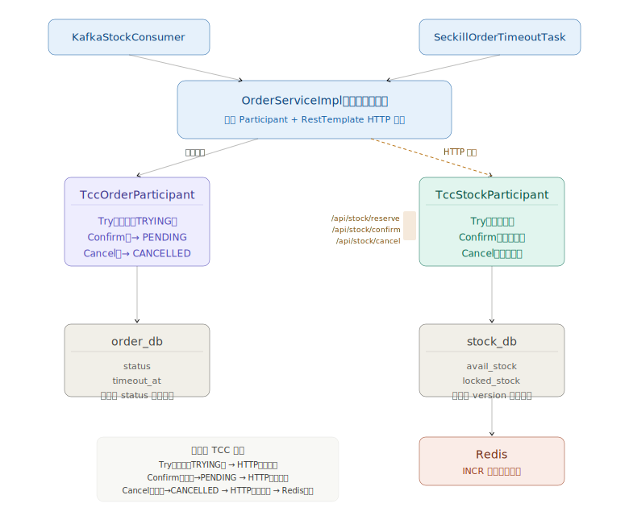

# 第五讲：分布式事务 —— TCC 补偿型事务

## 一、作业要求

### 场景描述
在商品秒杀系统中，订单服务和库存服务是两个独立的微服务，分别有各自数据库。

### 具体要求
1. 在秒杀下单时，基于 Redis 实现库存预扣减，防超卖、限购
2. 采用基于消息的一致性或 TCC 事务保障数据一致性
   - 下单 + 库存扣减一致性
   - 订单支付 + 订单状态更新一致性

## 二、分布式事务方案选型

### 2.1 方案对比

| 方案 | 一致性 | 性能 | 复杂度 | 适用场景 |
|------|--------|------|--------|---------|
| 2PC/XA | 强一致 | 差（同步阻塞） | 高 | 传统数据库 |
| **TCC** | **强一致** | **较好** | **中等** | **电商/金融** |
| 消息事务 | 最终一致 | 高 | 低 | 高并发异步 |

### 2.2 本系统选择 TCC 的原因

1. `seckill_product` 表已有 `locked_stock` 字段，天然适合 TCC 三阶段库存语义
2. 秒杀场景对库存准确性要求极高（不能超卖、不能漏单）
3. TCC 通过 Try 预留 + Confirm/Cancel 明确的状态机，保证强一致性
4. 与现有 Redis 预扣库存 + Kafka 异步架构无缝衔接
5. 微服务拆分后，跨库事务无法使用本地 `@Transactional`，TCC 通过 HTTP 调用实现跨服务事务

## 三、TCC 整体设计

### 3.1 架构概览


### 3.2 两个 TCC 参与者（各自独立服务）

| 参与者 | 所在服务 | 数据库 | Try | Confirm | Cancel |
|--------|---------|--------|-----|---------|--------|
| **TccStockParticipant** | stock-service | stock_db | `avail_stock -= qty, locked_stock += qty`（乐观锁） | `locked_stock -= qty`（永久消费） | `locked_stock -= qty, avail_stock += qty`（释放预留） |
| **TccOrderParticipant** | order-service | order_db | INSERT 订单 `status=-1 TRYING`, `timeout_at=now+15min` | `status: -1 -> 0 PENDING` | `status: -1 -> 2 CANCELLED` |

### 3.3 订单状态机



## 四、TCC 核心实现

### 4.1 TCC 库存参与者（stock-service）

**文件**：`stock-service/src/main/java/com/seckill/stock/tcc/TccStockParticipant.java`

```java
@Component
public class TccStockParticipant {

    // Try: 预留库存 (avail_stock -> locked_stock)
    public boolean tryReserve(Long productId, int quantity) {
        SeckillProduct sp = seckillProductMapper.findById(productId);
        // 乐观锁扣减，version不匹配则更新0行
        int updated = seckillProductMapper.decreaseStock(productId, quantity, sp.getVersion());
        return updated > 0;
    }

    // Confirm: 永久扣减 (locked_stock -= quantity)
    public boolean confirm(Long productId, int quantity) {
        SeckillProduct sp = seckillProductMapper.findById(productId);
        int updated = seckillProductMapper.confirmStock(productId, quantity, sp.getVersion());
        return updated > 0;
    }

    // Cancel: 释放预留 (locked_stock -> avail_stock)
    public boolean cancel(Long productId, int quantity) {
        SeckillProduct sp = seckillProductMapper.findById(productId);
        int updated = seckillProductMapper.cancelStock(productId, quantity, sp.getVersion());
        return updated > 0;
    }
}
```

通过 `StockController` 暴露 HTTP 接口供 order-service 调用：

```java
@RestController
@RequestMapping("/stock")
public class StockController {

    @PostMapping("/reserve")
    public ResultVO<Boolean> reserve(@RequestParam Long productId, @RequestParam int quantity) {
        boolean ok = stockParticipant.tryReserve(productId, quantity);
        return ok ? ResultVO.success(true) : ResultVO.fail("库存预留失败");
    }

    @PostMapping("/confirm")
    public ResultVO<Boolean> confirm(@RequestParam Long productId, @RequestParam int quantity) {
        boolean ok = stockParticipant.confirm(productId, quantity);
        return ok ? ResultVO.success(true) : ResultVO.fail("库存确认失败");
    }

    @PostMapping("/cancel")
    public ResultVO<Boolean> cancel(@RequestParam Long productId, @RequestParam int quantity) {
        boolean ok = stockParticipant.cancel(productId, quantity);
        if (ok) {
            redisUtils.increment("seckill:stock:" + productId, quantity);  // Redis 回滚
        }
        return ok ? ResultVO.success(true) : ResultVO.fail("库存取消失败");
    }
}
```

**关键 SQL**（stock_db）：

```sql
-- Try: 预留库存
UPDATE seckill_product
SET avail_stock = avail_stock - #{quantity},
    locked_stock = locked_stock + #{quantity},
    version = version + 1
WHERE id = #{id} AND avail_stock >= #{quantity} AND version = #{version}

-- Confirm: 永久扣减
UPDATE seckill_product
SET locked_stock = locked_stock - #{quantity},
    version = version + 1
WHERE id = #{id} AND locked_stock >= #{quantity} AND version = #{version}

-- Cancel: 释放预留
UPDATE seckill_product
SET locked_stock = locked_stock - #{quantity},
    avail_stock = avail_stock + #{quantity},
    version = version + 1
WHERE id = #{id} AND locked_stock >= #{quantity} AND version = #{version}
```

### 4.2 TCC 订单参与者（order-service）

**文件**：`order-service/src/main/java/com/seckill/order/tcc/TccOrderParticipant.java`

```java
@Component
public class TccOrderParticipant {

    // Try: 创建临时订单 (status=TRYING, timeout_at=now+15min)
    public Order tryCreateOrder(Long userId, Long productId, int productType,
                                String productName, int quantity,
                                BigDecimal unitPrice, int timeoutMinutes) {
        // 幂等检查
        if (orderMapper.countSeckillOrder(userId, productId) > 0) return null;

        Order order = new Order();
        order.setOrderNo(snowflakeIdGenerator.nextId());
        order.setStatus(Order.STATUS_TRYING);          // -1
        order.setTimeoutAt(LocalDateTime.now().plusMinutes(timeoutMinutes));
        orderMapper.insert(order);
        return order;
    }

    // Confirm: TRYING -> PENDING（幂等）
    public boolean confirm(String orderNo) {
        Order order = orderMapper.findByOrderNo(orderNo);
        if (order.getStatus() == Order.STATUS_PENDING) return true;  // 幂等
        return orderMapper.confirmOrderStatus(order.getId(),
                Order.STATUS_TRYING, Order.STATUS_PENDING) > 0;
    }

    // Cancel: TRYING -> CANCELLED（幂等）
    public boolean cancel(String orderNo) {
        Order order = orderMapper.findByOrderNo(orderNo);
        if (order.getStatus() == Order.STATUS_CANCELLED) return true;  // 幂等
        return orderMapper.confirmOrderStatus(order.getId(),
                Order.STATUS_TRYING, Order.STATUS_CANCELLED) > 0;
    }
}
```

### 4.3 跨服务 TCC 协调（OrderServiceImpl）

微服务拆分后，`TccTransactionCoordinator` 不再存在（无法跨库 `@Transactional`）。取而代之的是 `OrderServiceImpl` 作为隐式协调器：本地调用 `TccOrderParticipant` 操作 order_db，通过 `RestTemplate` HTTP 调用 stock-service 的接口操作 stock_db。

**文件**：`order-service/src/main/java/com/seckill/order/service/impl/OrderServiceImpl.java`

**Try 阶段**（KafkaStockConsumerService 中触发）：
```java
// 1. 本地 TCC Try（stock-service 内部）：预留库存
boolean reserved = stockParticipant.tryReserve(productId, quantity);

// 2. HTTP 调 order-service 创建 TRYING 订单
Map<String, Object> body = new HashMap<>();
body.put("userId", userId);
body.put("productId", productId);
body.put("quantity", quantity);
body.put("productName", productName);
body.put("unitPrice", unitPrice);
ResultVO orderResult = restTemplate.postForObject(
        orderServiceUrl + "/api/order/internal/create", body, ResultVO.class);

// 失败补偿：取消本地库存预留
if (orderResult == null || orderResult.getCode() != 200) {
    stockParticipant.cancel(productId, quantity);
    rollbackRedisStock(productId, quantity);
}
```

**Confirm 阶段**（payOrder 触发）：
```java
// 本地 Confirm：订单 TRYING → PENDING
tccOrderParticipant.confirm(orderNo);

// 远程 Confirm：库存 locked_stock -= qty
restTemplate.postForObject(stockServiceUrl + "/api/stock/confirm?productId="
        + productId + "&quantity=" + quantity, null, ResultVO.class);
// 失败需人工对账（订单已确认，库存确认失败）
```

**Cancel 阶段**（cancelOrder / 超时任务触发）：
```java
// 本地 Cancel：订单 TRYING → CANCELLED
tccOrderParticipant.cancel(orderNo);

// 远程 Cancel：库存释放 + Redis 回滚
restTemplate.postForObject(stockServiceUrl + "/api/stock/cancel?productId="
        + productId + "&quantity=" + quantity, null, ResultVO.class);
```

## 五、TCC 在秒杀流程中的整合

### 5.1 完整时序

```
用户发起秒杀
  │
  ▼
StockSeckillServiceImpl.doSeckill() [stock-service]
  ├── Redis DECR 预扣库存（<1ms）
  ├── Redis SETNX 幂等标记（<1ms）
  ├── Kafka 发送消息
  └── 返回 "PROCESSING"
  │
  ▼
KafkaStockConsumerService.handleSeckillOrder() [stock-service]
  ├── HTTP 幂等检查：GET /api/order/internal/count [order-service]
  └── 本地 TCC Try：库存预留（stock_db 事务）
  └── HTTP TCC Try：POST /api/order/internal/create [order-service]
       └── TccOrderParticipant.tryCreateOrder()：创建 TRYING 订单（order_db 事务）
  │
  ▼
订单 status = TRYING(-1)，等待用户操作
  │
  ├── 用户支付 ──→ payOrder() [order-service]
  │                 ├── TccOrderParticipant.confirm()：订单 -1 → 0 PENDING（本地）
  │                 └── HTTP POST /api/stock/confirm [stock-service]
  │                      └── TccStockParticipant.confirm()：库存永久扣减
  │                 └── updateStatus(1) PAID
  │
  ├── 用户取消 ──→ cancelOrder() [order-service]
  │                 ├── TccOrderParticipant.cancel()：订单 -1 → 2 CANCELLED（本地）
  │                 └── HTTP POST /api/stock/cancel [stock-service]
  │                      ├── TccStockParticipant.cancel()：库存释放
  │                      └── Redis INCR 回滚
  │
  └── 超时(15min) ──→ SeckillOrderTimeoutTask [order-service]（每30秒扫描）
                       ├── TccOrderParticipant.cancel()（本地）
                       └── HTTP POST /api/stock/cancel [stock-service]
                            ├── 库存释放
                            └── Redis INCR 回滚
```

### 5.2 Kafka 消费者改造

**改造前（单体）**：调用 `TccTransactionCoordinator.tryPhase()` 在一个 `@Transactional` 中完成库存预留 + 订单创建

**改造后（微服务）**：`KafkaStockConsumerService` 先本地预留库存，再 HTTP 调 order-service 创建订单

```java
@KafkaListener(topics = "seckill-order", groupId = "seckill-order-group")
@DS(DataSourceType.MASTER)
public void handleSeckillOrder(ConsumerRecord<String, SeckillOrderMessage> record,
                               Acknowledgment acknowledgment) {
    SeckillOrderMessage msg = record.value();

    // 1. HTTP 幂等校验：调 Order Service
    int count = restTemplate.getForObject(
            orderServiceUrl + "/api/order/internal/count?userId=" + msg.getUserId()
            + "&productId=" + msg.getSeckillProductId(), ResultVO.class);
    if (count > 0) { acknowledgment.acknowledge(); return; }

    // 2. 本地 TCC Try（stock_db 事务）：预留库存
    boolean reserved = stockParticipant.tryReserve(msg.getSeckillProductId(), msg.getQuantity());
    if (!reserved) { rollbackRedisStock(...); acknowledgment.acknowledge(); return; }

    // 3. HTTP TCC Try（order_db 事务）：创建 TRYING 订单
    ResultVO orderResult = restTemplate.postForObject(
            orderServiceUrl + "/api/order/internal/create", body, ResultVO.class);
    if (orderResult == null || orderResult.getCode() != 200) {
        stockParticipant.cancel(...);  // 补偿
        rollbackRedisStock(...);
        acknowledgment.acknowledge();
        return;
    }
    acknowledgment.acknowledge();
}
```

### 5.3 支付/取消改造

**payOrder**（order-service）：
- 秒杀订单 TRYING 状态 → 本地 `tccOrderParticipant.confirm()` → HTTP POST `/api/stock/confirm`
- Confirm 失败时记录日志："订单已确认，库存确认失败需要人工对账"

**cancelOrder**（order-service）：
- TRYING 状态 → 本地 `tccOrderParticipant.cancel()` → HTTP POST `/api/stock/cancel`
- PENDING 状态 → 改为 CANCELLED → HTTP POST `/api/stock/cancel`（秒杀）或 `/api/stock/increase`（普通）

## 六、超时自动取消机制

### 6.1 定时任务

**文件**：`order-service/src/main/java/com/seckill/order/task/SeckillOrderTimeoutTask.java`

```java
@Scheduled(fixedDelay = 30000, initialDelay = 60000)  // 每30秒，启动60秒后首次执行
public void cancelTimeoutOrders() {
    List<Order> timeoutOrders = orderMapper.findTimeoutTryingOrders();
    for (Order order : timeoutOrders) {
        // 1. 本地 Cancel：订单 TRYING → CANCELLED（order_db）
        tccOrderParticipant.cancel(order.getOrderNo());

        // 2. 远程 Cancel：库存释放 + Redis 回滚（stock_db）
        restTemplate.postForObject(stockServiceUrl + "/api/stock/cancel?productId="
                + order.getProductId() + "&quantity=" + order.getQuantity(),
                null, ResultVO.class);
    }
}
```

### 6.2 超时查询 SQL

```sql
SELECT * FROM `order`
WHERE status = -1
  AND timeout_at IS NOT NULL
  AND timeout_at < NOW()
LIMIT 100
```

### 6.3 为什么需要超时机制

TCC 的 Try 阶段预留了库存（`locked_stock`），如果用户既不支付也不取消，库存将永远被锁定。超时机制确保在 `timeout_at`（默认15分钟）后自动执行 Cancel，释放被锁定的库存。

## 七、防超卖与数据一致性

### 7.1 四层防线

| 防线 | 位置 | 服务 | 机制 | 作用 |
|------|------|------|------|------|
| 第一层 | Redis | stock-service | `DECR` 原子操作 | 挡住99%无效请求 |
| 第二层 | Redis | stock-service | `SETNX` 幂等标记 | 防止同一用户重复下单 |
| 第三层 | stock_db | stock-service | TCC Try 乐观锁 | `avail_stock >= qty AND version = ?` |
| 第四层 | stock_db | stock-service | TCC Confirm 乐观锁 | `locked_stock >= qty AND version = ?` |

### 7.2 TCC 幂等性保证

| 阶段 | 服务 | 幂等机制 |
|------|------|---------|
| Try | order-service | DB 层 `countSeckillOrder` 排除 TRYING 和 CANCELLED |
| Confirm | order-service / stock-service | 状态检查：已是 PENDING / 已扣减则直接返回成功 |
| Cancel | order-service / stock-service | 状态检查：已是 CANCELLED / 已释放则直接返回成功 |
| 超时取消 | order-service | `confirmOrderStatus` 带 `WHERE status = -1` 条件 |

### 7.3 一致性总结

```
成功路径:
  Redis DECR -> SETNX -> Kafka -> HTTP幂等校验
  -> 本地TCC Try(stock_db预留) -> HTTP TCC Try(order_db建TRYING单)
  -> 用户支付 -> 本地Confirm(→PENDING) -> HTTP Confirm(库存扣减) -> 标记PAID

取消路径:
  Redis DECR -> SETNX -> Kafka -> 本地TCC Try -> HTTP TCC Try
  -> 用户取消/超时 -> 本地Cancel(→CANCELLED) -> HTTP Cancel(库存释放+Redis INCR)

失败路径1（本地库存预留失败）:
  本地TCC Try失败 -> Redis INCR回滚 -> 不ACK(Kafka重试)

失败路径2（远程订单创建失败）:
  本地TCC Try成功 -> HTTP订单创建失败 -> 本地TCC Cancel + Redis INCR -> ACK

失败路径3（Confirm失败）:
  本地Confirm成功 -> HTTP Confirm失败 -> 记录日志，人工对账

库存数据流:
  总库存 = avail_stock + locked_stock（Try阶段）
  总库存 = 0 + locked_stock（Confirm后，库存永久消费）
  总库存 = avail_stock + 0（Cancel后，库存恢复可用）
```
