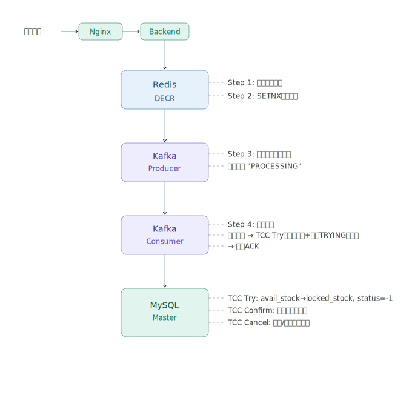
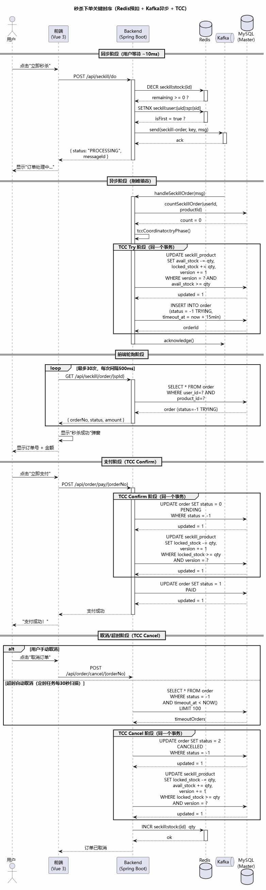

# 第四讲：高并发写 —— 消息队列与秒杀下单

## 一、作业要求

- 实现秒杀下单功能，建议 Redis 缓存库存，Kafka 异步处理订单创建，削峰填谷
- 使用雪花算法或基因算法生成订单ID，支持按用户ID或订单ID查询订单
- 幂等性：防止重复下单（同一用户同一商品只能秒杀一次）
- 数据一致性：保证最终库存不超卖，订单数据完整

## 二、秒杀下单整体流程

### 2.1 架构概览



> **注意**：Kafka 消费者不再直接 INSERT 订单，而是调用 `TccTransactionCoordinator.tryPhase()` 完成 TCC Try 阶段。详细 TCC 设计参见第五讲文档。

### 2.2 关键时序



## 三、Redis 库存预扣减

### 3.1 库存预热

系统启动时，将所有秒杀商品的库存加载到 Redis：

```java
// SeckillProductServiceImpl.java - @PostConstruct
@PostConstruct
public void warmUpAllStock() {
    List<SeckillProduct> list = seckillProductMapper.findAllActive();
    for (SeckillProduct sp : list) {
        String key = "seckill:stock:" + sp.getId();
        redisUtils.set(key, String.valueOf(sp.getAvailStock()), 24, TimeUnit.HOURS);
    }
}
```

也支持手动预热接口：`POST /api/seckill/warmup/{id}`

### 3.2 原子预扣库存

```java
// SeckillServiceImpl.java - doSeckill()
String stockKey = "seckill:stock:" + spId;

// 缓存不存在时自动加载（兼容Redis重启场景）
if (Boolean.FALSE.equals(redisUtils.hasKey(stockKey))) {
    redisUtils.set(stockKey, String.valueOf(sp.getAvailStock()), 24, TimeUnit.HOURS);
}

// Redis DECR 原子操作 —— 线程安全，无需加锁
Long remaining = redisUtils.decrement(stockKey);
if (remaining < 0) {
    // 库存不足，立即回滚
    redisUtils.increment(stockKey);
    throw new RuntimeException("秒杀失败：库存不足");
}
```

**为什么用 DECR 而不是先 GET 再 SET？**
- `DECR` 是 Redis 原子操作，在高并发下不会出现超卖
- 如果用 GET + 判断 + SET，存在竞态条件窗口

## 四、Kafka 异步订单处理

### 4.1 Kafka 配置

| 配置项 | 值 | 说明 |
|-------|------|------|
| Topic | `seckill-order` | 秒杀订单主题 |
| Partitions | 3 | 提高并行消费能力 |
| Replication Factor | 1 | 单节点部署 |
| Producer acks | `all` | 所有副本确认，最高可靠性 |
| Producer idempotence | `true` | 生产者幂等，防止重复发送 |
| Consumer group | `seckill-order-group` | 消费者组 |
| Consumer ack mode | `manual_immediate` | 手动提交偏移量 |

### 4.2 生产者（KafkaProducerServiceImpl）

```java
public void sendSeckillOrder(SeckillOrderMessage msg) {
    // 使用 userId:spId 作为key，保证同一用户同一商品的消息发到同一分区
    String key = msg.getUserId() + ":" + msg.getSeckillProductId();
    String json = objectMapper.writeValueAsString(msg);
    kafkaTemplate.send("seckill-order", key, json);
}
```

**分区策略**：以 `userId:spId` 作为消息 Key，通过 Hash 保证同一用户对同一商品的秒杀消息始终进入同一分区，保证消费顺序性。

### 4.3 消费者（KafkaOrderConsumerService）

```java
@KafkaListener(topics = "seckill-order", groupId = "seckill-order-group")
public void handleSeckillOrder(ConsumerRecord<String, SeckillOrderMessage> record,
                               Acknowledgment acknowledgment) {
    SeckillOrderMessage msg = record.value();

    // 1. 幂等校验（DB层）
    int count = orderMapper.countSeckillOrder(msg.getUserId(), msg.getSeckillProductId());
    if (count > 0) {
        acknowledgment.acknowledge();  // 已处理过，直接ACK
        return;
    }

    // 2. TCC Try 阶段：库存预留 + 创建 TRYING 状态订单
    Order order = tccCoordinator.tryPhase(
            msg.getUserId(), msg.getSeckillProductId(), msg.getQuantity(),
            msg.getProductName(), msg.getUnitPrice());
    if (order == null) {
        rollbackRedisStock(msg.getSeckillProductId(), msg.getQuantity());
        acknowledgment.acknowledge();
        return;
    }

    // 3. 手动ACK
    acknowledgment.acknowledge();
}
```

> **改造说明**：消费者不再直接操作库存和订单，而是委托给 `TccTransactionCoordinator.tryPhase()`。Try 阶段在一个事务内完成库存预留（`avail_stock → locked_stock`）和订单创建（`status=-1 TRYING`），任一失败则自动回滚。后续支付/取消通过 Confirm/Cancel 阶段完成。

### 4.4 前端轮询机制

秒杀请求返回 `PROCESSING` 状态后，前端每秒轮询查询订单结果：

```javascript
// SeckillDetail.vue
const pollResult = async () => {
    for (let i = 0; i < 30; i++) {  // 最多轮询30秒
        await sleep(1000);
        const res = await getSeckillOrder(spId);
        if (res.data) {
            // 订单已创建，显示结果
            orderResult.value = res.data;
            return;
        }
    }
    // 超时
    ElMessage.warning('订单处理超时，请稍后在订单列表中查看');
};
```

## 五、雪花算法订单ID生成

### 5.1 算法结构

```
 0 ─────────────────────────────────────────────────────── 63
 │  1 bit  │     41 bits      │  5 bits  │  5 bits  │ 12 bits │
 │  符号位  │    时间戳差值     │ 数据中心  │  机器ID  │  序列号  │
 │  (0)    │  (ms since epoch)│ (0-31)   │ (0-31)   │(0-4095) │
 └─────────┴──────────────────┴──────────┴──────────┴─────────┘
```

### 5.2 实现要点

```java
// SnowflakeIdGenerator.java
public class SnowflakeIdGenerator {
    private static final long EPOCH = 1704067200000L;  // 2024-01-01 00:00:00 UTC

    public synchronized long nextId() {
        long timestamp = System.currentTimeMillis();

        // 时钟回拨检测
        if (timestamp < lastStamp) {
            throw new RuntimeException("时钟回拨，拒绝生成ID");
        }

        if (timestamp == lastStamp) {
            // 同一毫秒内，序列号递增
            sequence = (sequence + 1) & SEQUENCE_MASK;
            if (sequence == 0) {
                timestamp = waitNextMillis(lastStamp);  // 序列号用尽，等待下一毫秒
            }
        } else {
            sequence = 0L;  // 新毫秒，序列号重置
        }

        lastStamp = timestamp;
        return ((timestamp - EPOCH) << 12) | (datacenterId << 7) | (workerId << 2) | sequence;
    }
}
```

### 5.3 性能指标

| 指标 | 值 |
|------|------|
| 每毫秒最大ID数 | 4096（12位序列号） |
| 每秒最大ID数 | 4,096,000 |
| 可用年限 | ~69年（41位时间戳） |
| 理论最大机器数 | 32 × 32 = 1024台 |

### 5.4 ID生成策略对比

| 场景 | 策略 | 原因 |
|------|------|------|
| 秒杀订单 | 雪花算法 | 全局唯一、趋势递增、支持高并发 |
| 普通订单 | 时间戳+UUID | 简单场景，无需雪花算法的复杂度 |
| Kafka消息ID | 雪花算法 | 需要全局唯一的消息追踪标识 |

## 六、幂等性保障（双重防护）

### 6.1 防重复下单设计


### 6.2 Redis 层幂等

```java
String userKey = String.format("seckill:user:%d:sp:%d", userId, spId);
Boolean isFirst = redisUtils.setIfAbsent(userKey, "1", 24, TimeUnit.HOURS);
if (Boolean.FALSE.equals(isFirst)) {
    redisUtils.increment(stockKey);  // 回滚预扣的库存
    throw new RuntimeException("每人每件秒杀商品限购1次");
}
```

- Key 有效期 24 小时，覆盖秒杀活动周期
- 用 SETNX 保证只有一个线程能成功写入

### 6.3 DB 层幂等

```java
// Kafka消费者中再次校验
int count = orderMapper.countSeckillOrder(msg.getUserId(), msg.getSeckillProductId());
if (count > 0) {
    acknowledgment.acknowledge();  // 已有订单，跳过
    return;
}
```

```xml
<!-- OrderMapper.xml -->
<select id="countSeckillOrder" resultType="int">
    SELECT COUNT(*) FROM `order`
    WHERE user_id = #{userId}
      AND product_id = #{productId}
      AND product_type = 1
      AND status != 2
</select>
```

**为什么需要双重防护？**
- Redis 层：拦截大部分重复请求，速度快（<1ms）
- DB 层：防止 Redis 数据丢失（如重启）导致的重复下单，是最终防线

## 七、数据一致性保障

### 7.1 防超卖四层防线 + TCC

| 防线 | 位置 | 机制 | 作用 |
|------|------|------|------|
| 第一层 | Redis | `DECR` 原子操作 | 挡住99%无效请求 |
| 第二层 | Redis | `SETNX` 幂等标记 | 防止同一用户重复下单 |
| 第三层 | MySQL | TCC Try 乐观锁（`avail→locked`） | 库存预留，防超卖 |
| 第四层 | MySQL | TCC Confirm 乐观锁（`locked -= qty`） | 支付时永久扣减 |

### 7.2 MySQL TCC 乐观锁 SQL

**Try 阶段**（库存预留）：
```sql
UPDATE seckill_product
SET avail_stock = avail_stock - #{quantity},
    locked_stock = locked_stock + #{quantity},
    version = version + 1
WHERE id = #{id}
  AND avail_stock >= #{quantity}
  AND version = #{version}
```

**Confirm 阶段**（永久扣减）：
```sql
UPDATE seckill_product
SET locked_stock = locked_stock - #{quantity},
    version = version + 1
WHERE id = #{id}
  AND locked_stock >= #{quantity}
  AND version = #{version}
```

**Cancel 阶段**（释放库存）：
```sql
UPDATE seckill_product
SET locked_stock = locked_stock - #{quantity},
    avail_stock = avail_stock + #{quantity},
    version = version + 1
WHERE id = #{id}
  AND locked_stock >= #{quantity}
  AND version = #{version}
```

如果 `version` 不匹配（其他事务已修改），UPDATE 影响 0 行，返回 `updated == 0`。

### 7.3 失败回滚机制

```java
// KafkaOrderConsumerService.java
private void rollbackRedisStock(Long seckillProductId, int quantity) {
    String stockKey = "seckill:stock:" + seckillProductId;
    stringRedisTemplate.opsForValue().increment(stockKey, quantity);
}
```

**触发回滚的场景**：
1. MySQL 乐观锁冲突（`updated == 0`）
2. 商品不存在或库存不足
3. 消费者处理异常（不ACK，Kafka自动重试）

### 7.4 一致性总结

```
成功路径:  Redis DECR → SETNX → Kafka → TCC Try(库存预留+TRYING订单) → 用户支付 → TCC Confirm → 已支付
取消路径:  Redis DECR → SETNX → Kafka → TCC Try → 用户取消/超时 → TCC Cancel(库存释放+CANCELLED) → Redis INCR
失败路径1: Redis DECR → SETNX → Kafka → TCC Try失败 → Redis INCR回滚 → 不ACK(Kafka重试)
失败路径2: Redis DECR → SETNX失败 → Redis INCR回滚 → 返回错误
失败路径3: Redis DECR < 0 → Redis INCR回滚 → 返回错误
```

## 八、API 接口

| 方法 | 路径 | 说明 |
|------|------|------|
| GET | `/api/seckill/products` | 获取秒杀商品列表 |
| GET | `/api/seckill/product/{id}` | 获取秒杀商品详情 |
| POST | `/api/seckill/do` | 提交秒杀请求，返回排队状态 |
| GET | `/api/seckill/order/{spId}` | 轮询查询秒杀订单结果 |
| POST | `/api/seckill/warmup/{id}` | 手动预热指定商品库存 |

### 秒杀请求体

```json
{
    "seckillProductId": 1,
    "quantity": 1
}
```

### 秒杀响应体

```json
{
    "code": 200,
    "message": "success",
    "data": {
        "messageId": 1234567890123456789,
        "status": "PROCESSING",
        "message": "秒杀请求已提交，订单处理中..."
    }
}
```

## 九、压测预期

| 指标 | 预期值 |
|------|-------|
| 秒杀接口响应时间 | < 20ms（仅Redis操作+Kafka发送） |
| QPS | 单实例 3000+，双实例 5000+ |
| 库存准确性 | 不超卖、不漏单 |
| 订单创建延迟 | Kafka消费延迟，通常 < 1秒 |
